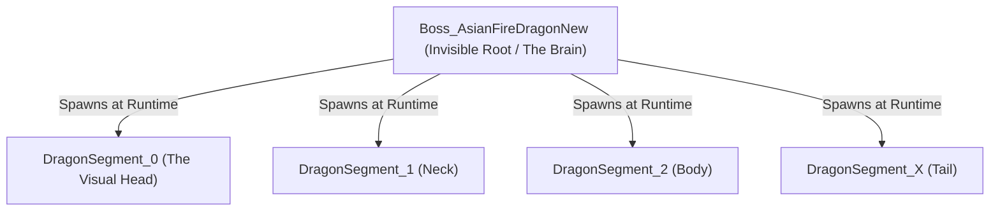

# Dragon Movement Architecture

## 1. Goal and Movement Concept
The objective is to create a massive, multi-segmented Asian Dragon boss that flies smoothly and organically through the VR space. The movement must feel fluid, alive, and continuous, avoiding robotic pauses, stuttering, or rigid "wooden" tracking.

The dragon dynamically transitions between:
1.  **Observation / Recharging:** Smoothly circling on a closed spline track.
2.  **Freestyle Attacking:** Breaking away from tracks to swoop, pursue, or bank in the open air.
3.  **Escaping:** Seamlessly docking onto linear escape splines.

### The "Fish" Movement Concept
The core visual concept relies on decoupling **navigation** from **animation**:
*   **Navigation:** The dragon behaves like a fish swimming between waypoints. It never stops moving forward. When it needs to change direction or transition to a new track, it simply steers its velocity smoothly toward the target without halting its momentum.
*   **Animation (The Snake Ripple):** To simulate a living creature, the head constantly wobbles (sways) slightly side-to-side. Rather than plotting the entire body along an invisible winding track, the body relies on physical follow-the-leader mechanics. Segment 1 looks at the Head, Segment 2 looks at Segment 1, etc. This inherently catches the head's wobble and cascades it beautifully down the entire length of the tail.

---

## 2. GameObject Hierarchy
The dragon is divided into a Brain (the invisible root) and a Body (the dynamically spawned visual meshes).

---

## 3. Script Responsibilities (Separation of Concerns)

To achieve the fluid motion without scripts fighting each other, the architecture is strictly modularized into four single-responsibility components.

### Placed on the Root Object (`Boss_AsianFireDragonNew`)
These scripts handle the logic and physics of the entity as a whole.

**1. AirborneBossMovement.cs (The Pilot)**
*   **Job:** Navigates the Root object through the scene.
*   **How it works:** It receives commands from the AI Brain (e.g., "Go to Escape Spline", "Pursue Player"). It pushes the Root continuously forward. If it needs to transition between states, it uses continuous "Fish Steering"—`Slerp`ing its rotation smoothly toward the target waypoint without ever stalling its forward speed.

**2. DragonMovementManager.cs (The Spacing Physics)**
*   **Job:** Ensures the body segments stay correctly spaced behind the Root.
*   **How it works:** It drops invisible breadcrumbs along the straight-line path of the Root. It then physically drags the instantiated segments (`DragonSegment_1`, `2`, etc.) along this trail to guarantee perfect spacing and gap-closing if a segment is destroyed.
*   **Crucially:** It ONLY controls Position. It does not dictate Rotation, to avoid creating a rigid, wooden line.

---

### Placed on the Head Object (`DragonSegment_0`)
These scripts are purely visual and handle the organic, snake-like animation.

**3. DragonHeadWobble.cs (The Snake Head)**
*   **Job:** Creates the side-to-side snaking animation.
*   **How it works:** It applies a continuous sine-wave offset to the Head's local position and rotation. Because it is local, it wobbles the visual head independently without dragging the invisible Root object off its navigation course.

**4. DragonBodySegmentRippleAnimator.cs (The Cascade)**
*   **Job:** Forces the body to dynamically follow the wobbling head.
*   **How it works:** It dynamically finds all sibling segments. Running in `LateUpdate` (after the physics manager has spaced them), it uses `Quaternion.LookRotation` to force each segment to look directly at the physical segment immediately in front of it.
*   **The Result:** Because the Head is wobbling, Segment 1 turns to follow it, causing Segment 2 to turn slightly later. This beautiful delay naturally ripples the wobble all the way down the spine.

---

## 4. Execution Rules (Prompt Constraints)
When writing the C# code for this architecture, the following constraints are absolute and must not be violated:

1. **NO Breadcrumbs for Body Segments:** The breadcrumb manager (`DragonMovementManager`) is strictly for maintaining the physical spacing/distance of the segments along the Root's path. It MUST NOT dictate segment rotation.
2. **NO Stalling in Navigation:** `AirborneBossMovement.cs` must use continuous forward translation (`transform.position += transform.forward`). It must steer using `Quaternion.Slerp` towards the target spline. Do NOT use `Vector3.Lerp` or `SmoothStep` timers that cause the dragon to stall at the start/end of a transition.
3. **NO Script Fighting:** The cascading rotation logic must live entirely inside the `DragonBodySegmentRippleAnimator` (or similar script) on the Head. Do not attempt to calculate ripple logic or wobbles inside the Root physics scripts.
4. **DO NOT Rewrite Existing Managers:** The user's spacing and segment instantiation managers work perfectly. Do not alter their logic. Only strip out conflicting rotation code if absolutely necessary.
