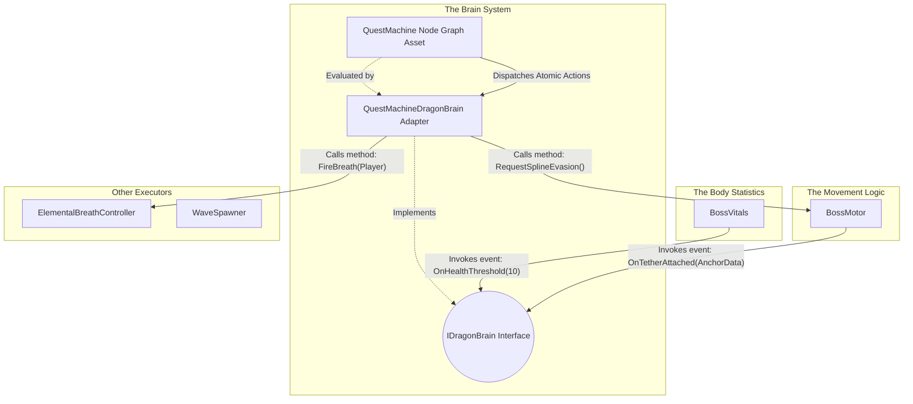

# Dragon Boss AI & Quest Machine Integration

## Technical Overview

This project uses **Quest Machine** (by PixelCrushers) as a visual, node-based **Combat AI State Machine** to control boss behavior (e.g., the Dragon). 

Instead of writing state machine logic in C#, the boss's behavior is designed in Quest Machine's node editor. 

- **Quest Nodes** represent the **AI States** (e.g., Scan, AttackCrystal, Swoop, ToppleObject, Reposition).
- **Node Conditions** act as **Transition Rules** (determining when the boss leaves a state and enters another).
- **Node Actions** define what the boss **executes** when entering or during that state (such as playing an animation, moving, or triggering an attack).

The Quest Machine UI is disabled. The `DragonBrainController` loads this "quest" in the background, and the boss executes it to fight the player. Below is a breakdown of our first iteration, its technical flaws, and the refactored modular architecture we are adopting.

---

## Phase 1: The First Attempt (Current Implementation)

Our initial approach proved that Quest Machine could drive AI, but the implementation tightly coupled systems and mixed class responsibilities.

### The Components

1. **`DragonBrainController`**
   - **Role:** Instantiates the `Quest` asset, adding it to a `QuestJournal` component to start the node sequence.

2. **`DragonActionListeners`**
   - **Role:** Listens for `"DragonActions"` strings broadcast by the Quest Machine Message System.
   - **The Flaw:** It is heavily coupled. It receives a macro-string like `"Swoop"`, then manually alters phase states in `BossCreature`, triggers attacks on `ElementalBreathController`, and dictates movement on `AirborneBossMovement`.

3. **`BossCreature`**
   - **Role:** Tracks numeric values (Health, Stamina) and an enum state (`BossPhase`).
   - **The Flaw:** It mixes variable tracking with combat logic overrides. For example, in its `Update()` loop, if stamina hits zero, it triggers a function to force an evasion. This bypasses the Quest Machine entirely, splitting the AI logic into two separate locations.

4. **`AirborneBossMovement`**
   - **Role:** Moves the transform using flight intents (`Pursue`, `Bank`, `Stillhold`) and spline followers.
   - **The Flaw:** Instead of purely receiving movement coordinates, it contains its own logic checks. It queries `BossCreature.currentPhase` and `BossCreature.GetCurrentHealthPct()` internally to calculate where it should fly. 

### Architectural Flaws
- **Scattered AI Logic:** The combat logic is split between Quest Machine nodes, `BossCreature` overrides, and `AirborneBossMovement` calculations. 
- **Coupling:** Classes cannot function independently. Movement relies on Health data, and Health data triggers Movement.

---

## Phase 2: The Optimal Solution (Architectural Evolution)

To fix the coupling and scattered logic, the architecture is being rebuilt into strictly separated components.

### Technical Responsibilities & Data Flow

#### 1. The Body Statistics (`BossVitals`)
- **Role:** A data container for floats (Health, Stamina) and enums (Status Effects).
- **What it does:** It runs the math when damage is taken. When a value crosses a specific threshold (e.g., Stamina drops to 0), it invokes a C# event. It contains zero logic for deciding how the boss should react to that damage.

#### 2. The Movement Logic (`BossMotor`)
- **Role:** A script that manipulates `transform.position` and `transform.rotation`.
- **What it does:** It contains the mathematical formulas required to move the object (freestyle math, spline math). It relies entirely on public methods being called to provide its target destination. It acts as a spatial sensor, firing events (e.g., `OnTetherAttached()`) when collisions occur.

#### 3. The Brain System (De-tangled)
In Phase 1, the "Brain" was a confusing mix of concepts. In Phase 2, it is strictly separated into three technical parts:

1. **`IDragonBrain` (The Interface):** This is just a C# contract. It guarantees that any class implementing it has methods like `OnDamageTaken(float amount)` and `OnStaminaDepleted()`. `BossVitals` and `BossMotor` only talk to this interface. They do not know Quest Machine exists.
2. **`QuestMachineDragonBrain` (The Adapter Script):** This is a C# script attached to the boss. It implements `IDragonBrain`. 
   - **Input:** When `BossVitals` fires an event, this Adapter catches it, and mathematically updates the corresponding "Counter" or "Condition" variables *inside* the Quest Machine API.
   - **Output:** When Quest Machine executes an action, this Adapter translates that action into public method calls on the Motor and Body scripts.
3. **The Quest Machine Node Graph (The Logic Data):** This is the visual asset created in the Unity Editor. **This is where the actual combat strategy and decision-making exist.** It continuously evaluates the variables updated by the Adapter. When conditions are met, it changes nodes and outputs Actions back to the Adapter.

---

### Proof of Concept: Uncoupling the Legacy Behaviors

In Phase 1, the `DragonActionListeners` script used a giant, heavily-coupled C# switch statement to parse macro-strings like `"Swoop"` and `"SpawnWave"`. 

To completely remove `DragonActionListeners` without losing functionality, we move the composition of behavior directly into the **Quest Machine Node UI** using **Atomic Custom Actions**. 

Instead of writing C# code that ties systems together, we write small, isolated scripts for Quest Machine (e.g., `SetMotorIntentAction`, `FireWeaponAction`, `SpawnMinionAction`, `SetPhaseAction`). The designer adds these atomic actions to a single Quest Node.

Below is the technical proof of concept demonstrating how the entire list of legacy behaviors from Phase 1 maps identically to uncoupled atomic actions inside the Quest Machine UI.

| Legacy Macro-String | What the Quest Machine Node UI Now Contains (The Atomic Actions List) |
| :--- | :--- |
| **"Pursuit"** | 1. `SetPhaseAction(Phase: Engaged)`   2. `SetMotorIntentAction(Intent: Pursue, Target: Player)` |
| **"Swoop"** | 1. `SetPhaseAction(Phase: Engaged)`   2. `SetMotorIntentAction(Intent: Pursue, Target: Player)`   3. `FireWeaponAction(Type: Fire, Target: Player)`   4. `StartCooldownAction(DesireType: Dominance)` |
| **"Bank"** | 1. `SetPhaseAction(Phase: Engaged)`   2. `SetMotorIntentAction(Intent: Withdraw, Offset: Up 20m)` |
| **"Bait" / "Herd" / "Flank"** | 1. `SetPhaseAction(Phase: Engaged)`   2. `SetMotorIntentAction(Intent: Pursue, Target: Player)` |
| **"SpawnWave"** | 1. `SpawnMinionAction(Intent: AllIn, Target: Player)`   2. `StartCooldownAction(DesireType: Attrition)` |
| **"Breath"** | 1. `SetPhaseAction(Phase: Engaged)`   2. `FireWeaponAction(Type: Fire, Target: Player)`   3. `StartCooldownAction(DesireType: ElementalAdvantage)` |
| **"DefendCrystal"** | 1. `RequestSplineAction(PathType: AirborneObservation)` |
| **"Evade" / "Ride Escape Spline"** | 1. `SetPhaseAction(Phase: Exhausted)`   2. `RequestSplineAction(PathType: AirborneEscape)` |
| **"Recharging"** | 1. `SetPhaseAction(Phase: Recharging)` |
| **"Regenerate"** | 1. `SetPhaseAction(Phase: Recharging)`   2. `TriggerRegenerationAction(Target: HealthCrystal)`   3. `RefillMinionReserveAction()` |
| **"Circle + Spawn Minions"** | 1. `SpawnMinionAction(Intent: Circle, Target: Player)` |

**The Result:** The Boss successfully executes every complex behavior required for combat. However, the `BossMotor` script has absolutely no idea that the `ElementalBreathController` fired or that Minions spawned, and none of them know what the `Phase` is. 

All logic and macro-behavior composition reside 100% inside the Quest Machine node graph, and the C# classes remain fully uncoupled and ignorant of each other.
