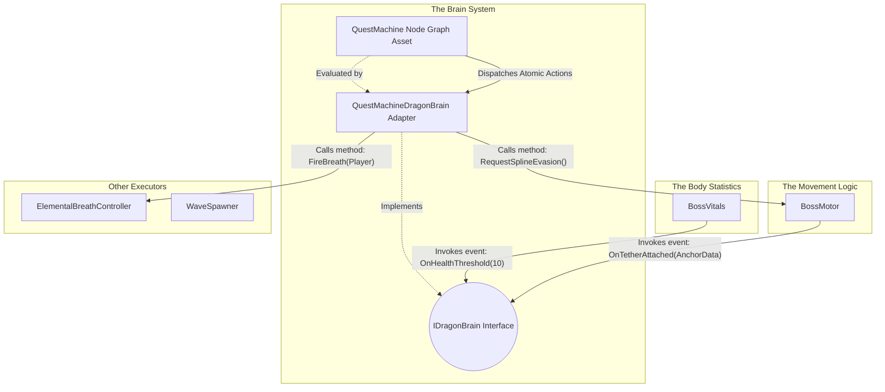

# Dragon Boss AI & Quest Machine Integration

## High-Level Concept

In this project, we are creatively using **Quest Machine** (a popular asset by PixelCrushers) not for a traditional player-facing quest log, but as a visual, node-based **Combat AI State Machine** for our bosses (e.g., the Dragon). 

Instead of writing complex, hard-to-maintain state machine logic in C#, we use Quest Machine's node editor to visually design the boss's behavior. 

- **Quest Nodes** represent the **AI States** (e.g., Scan, AttackCrystal, Swoop, ToppleObject, Reposition).
- **Node Conditions** act as **Transition Rules** (determining when the boss leaves a state and enters another).
- **Node Actions** define what the boss **executes** when entering or during that state (such as playing an animation, moving, or triggering an attack).

The Quest Machine UI is disabled. The `DragonBrainController` loads this "quest" in the background, and the boss executes it to fight the player. Below is a breakdown of our first iteration, its technical flaws, and the refactored modular architecture we are adopting.

---

## Phase 1: The First Attempt (Current Implementation)

Our initial approach proved that Quest Machine could drive AI, but the implementation tightly coupled systems and mixed class responsibilities. Every flaw in this design has been addressed by the new architecture.

### The Components

1. **`DragonBrainController`**
   - **Role:** Instantiates the `Quest` asset, adding it to a `QuestJournal` component to start the node sequence.

2. **`DragonActionListeners`**
   - **Role:** Listens for `"DragonActions"` strings broadcast by the Quest Machine Message System.
   - **The Flaw:** It is heavily coupled. It receives a macro-string like `"Swoop"`, then manually alters phase states in `BossCreature`, triggers attacks on `ElementalBreathController`, and dictates movement on `AirborneBossMovement`.
   - **The Solution:** The `DragonActionListeners` script is deleted entirely. In the new system, we use Atomic Custom Actions inside the Quest Machine UI. A node now simply fires independent actions (`SetPhase`, `SetMotorIntent`, `FireWeapon`), allowing the behaviors to execute simultaneously without the C# scripts ever referencing or knowing about each other.

3. **`BossCreature`**
   - **Role:** Tracks numeric values (Health, Stamina) and an enum state (`BossPhase`).
   - **The Flaw:** It mixes variable tracking with combat logic overrides. For example, in its `Update()` loop, if stamina hits zero, it triggers a function to force an evasion. This bypasses the Quest Machine entirely, splitting the AI logic into two separate locations.
   - **The Solution:** We replace this with `BossVitals`. When stamina hits zero in the new system, it merely fires an `OnStaminaDepleted()` event. The Quest Machine receives this event, updates its variables, and the Node Graph evaluates the condition to decide what to do. This ensures that 100% of the combat logic is consolidated visibly within the node editor, making the AI predictable and easy to adjust.

4. **`AirborneBossMovement`**
   - **Role:** Moves the transform using flight intents (`Pursue`, `Bank`, `Stillhold`) and spline followers.
   - **The Flaw:** Instead of purely receiving movement coordinates, it contains its own logic checks. It queries `BossCreature.currentPhase` and `BossCreature.GetCurrentHealthPct()` internally to calculate where it should fly. 
   - **The Solution:** We replace this with `BossMotor`. The motor is completely stripped of AI queries. It waits for the Brain to provide an intent and a target (e.g., `RequestFreestyleIntent(Pursue, Player)`). This benefits the architecture by making the movement logic entirely reusable for any boss or creature, as it no longer relies on specific boss state variables.

---

## Phase 2: The Optimal Solution (Architectural Evolution)

To fix the coupling and scattered logic, the architecture is being rebuilt into strictly separated components.



### Technical Responsibilities & Data Flow

#### 1. The Body Statistics (`BossVitals`)
- **Role:** A data container for floats (Health, Stamina) and enums (Status Effects).
- **What it does:** It runs the math when damage is taken. When a value crosses a specific threshold (e.g., Stamina drops to 0), it invokes a C# event. It contains zero logic for deciding how the boss should react to that damage.

#### 2. The Movement Logic (`BossMotor`)
- **Role:** A script that manipulates `transform.position` and `transform.rotation`.
- **What it does:** It contains the mathematical formulas required to move the object (freestyle math, spline math). It relies entirely on public methods being called to provide its target destination. It acts as a spatial sensor, firing events (e.g., `OnTetherAttached()`) when collisions occur.

#### 3. The Brain System (De-tangled)
In Phase 1, the "Brain" was a confusing mix of concepts. In Phase 2, it is strictly separated into three technical parts:

1. **`IDragonBrain` (The Interface):** This is just a C# contract. It guarantees that any class implementing it has methods like `OnDamageTaken(float amount)` and `OnStaminaDepleted()`. `BossVitals` and `BossMotor` only talk to this interface. They do not know Quest Machine exists.
2. **`QuestMachineDragonBrain` (The Adapter Script):** This is a C# script attached to the boss. It implements `IDragonBrain`. 
   - **Input:** When `BossVitals` fires an event, this Adapter catches it, and mathematically updates the corresponding "Counter" or "Condition" variables *inside* the Quest Machine API.
   - **Output:** When Quest Machine executes an action, this Adapter translates that action into public method calls on the Motor and Body scripts.
3. **The Quest Machine Node Graph (The Logic Data):** This is the visual asset created in the Unity Editor. **This is where the actual combat strategy and decision-making exist.** It continuously evaluates the variables updated by the Adapter. When conditions are met, it changes nodes and outputs Actions back to the Adapter.

---

## The Complete Master Logic: Unifying Reactive and Proactive Tactics

To truly understand how this architecture pulls everything together, we must look at the **Master Priority Logic** inside the Quest Machine node graph. 

The dragon does not just react to being hit; it proactively "thinks" about its environment. It evaluates Line of Sight (LOS), VR walking space, environmental hazards, and minion positioning to formulate a strategy.

The Quest Machine evaluates variables imported from the environment in a strict hierarchical order: **Survival -> Tactical Control -> Preparation -> Execution**.

Below is the unified Master Logic diagram showing how the dragon makes priority decisions.

```mermaid
graph TD
    Idle[Evaluate AI State] --> Priority1
    
    %% Priority 1: Survival (Reactive)
    subgraph 1. Survival Checks (Reactive)
        Priority1{Is Crystal Threatened?}
        Priority1 -- Yes --> Defend[Action: Defend Crystal]
        Priority1 -- No --> ThreatCheck{Health/Stamina Critical?}
        ThreatCheck -- Yes --> EvadeRegen[Action: Evade & Regenerate]
    end
    
    %% Priority 2: Tactical Environmental Control (Proactive)
    subgraph 2. Tactical Control (Proactive)
        ThreatCheck -- No --> CheckSpace{Player has clear LOS <br> OR large walking area?}
        CheckSpace -- Yes --> ToppleCheck{Are pillars/columns <br> available near player?}
        ToppleCheck -- Yes --> Topple[Action: Topple Column <br> to restrict space/vision]
        ToppleCheck -- No --> Clouds[Action: Cast Dark Spirit Clouds]
    end
    
    %% Priority 3: Ambush Preparation (Proactive)
    subgraph 3. Ambush Preparation
        CheckSpace -- No (Player is Obscured) --> SpawnCheck{Do I have stored <br> waves in hiding?}
        SpawnCheck -- No --> SpawnHidden[Action: Spawn Minions <br> in obscured/safe zones]
    end
    
    %% Priority 4: Execution
    subgraph 4. Aggressive Execution
        SpawnCheck -- Yes --> FinalCharge[Action: Coordinated Final Charge <br> Swoop + Swarm]
    end
    
    Defend -->|Action Complete| Idle
    EvadeRegen -->|Action Complete| Idle
    Topple -->|Action Complete| Idle
    Clouds -->|Action Complete| Idle
    SpawnHidden -->|Action Complete| Idle
    FinalCharge -->|Action Complete| Idle
```

### Explaining the Thought Process

To make this logic work, the C# Adapter translates environmental feedback into Quest Machine variables. The Dragon then steps through its priorities.

#### 1. Survival (Reactive)
Before doing anything else, the Dragon must secure its supply lines. 
- **The Evaluation:** The Brain checks `IsCrystalThreatened` and `IsHealthCritical`.
- **The Decision:** If its life or its crystal is in danger, it drops all tactical planning to aggressively **Defend the Crystal** or retreat to **Regenerate**.

#### 2. Tactical Control (Proactive Thinking)
If the Dragon is safe, it begins evaluating the arena geometry to put the player at a disadvantage.
- **The Evaluation:** The Brain checks the spatial variables: `PlayerWalkableArea` and `PlayerHasLineOfSight`.
- **The Decision:** If the player can move freely and see everything, the Dragon decides to strip those advantages. It checks `ColumnsAvailable`. If true, it executes an action to **Topple a Column**, cutting off player movement and creating a visual obstruction. If no columns are left, it casts **Dark Spirit Clouds** to achieve the same result.

#### 3. Ambush Preparation
Once the player's movement and vision are crippled, the Dragon uses that opportunity to prepare an overwhelming assault.
- **The Evaluation:** The Brain confirms the player is restricted (`PlayerWalkableArea < Threshold`). It then checks `StoredAmbushWavesReady`.
- **The Decision:** If it doesn't have an ambush ready, it executes the **Spawn Hidden Waves** action. Because the player's vision is blocked by the collapsed column or clouds, these minions spawn in untouchable safety.

#### 4. Coordinated Execution
- **The Evaluation:** The Dragon is healthy, the player is boxed in and blinded, and the ambush waves are fully staged.
- **The Decision:** The conditions are perfect. The node transitions to the **Coordinated Final Charge**. The Dragon commands the stored minion waves to attack while simultaneously executing a heavy **Swoop**, catching the restricted player in a devastating crossfire.

### Conclusion

By using this unified priority hierarchy, the Quest Machine node graph pulls all of the disjointed systems together. The C# scripts simply provide the raw data (Sensor: "Pillar is here", "Player is here"). The Node Editor processes that data to form a highly intelligent, proactive tactical strategy, achieving complete decoupling without sacrificing AI depth.
