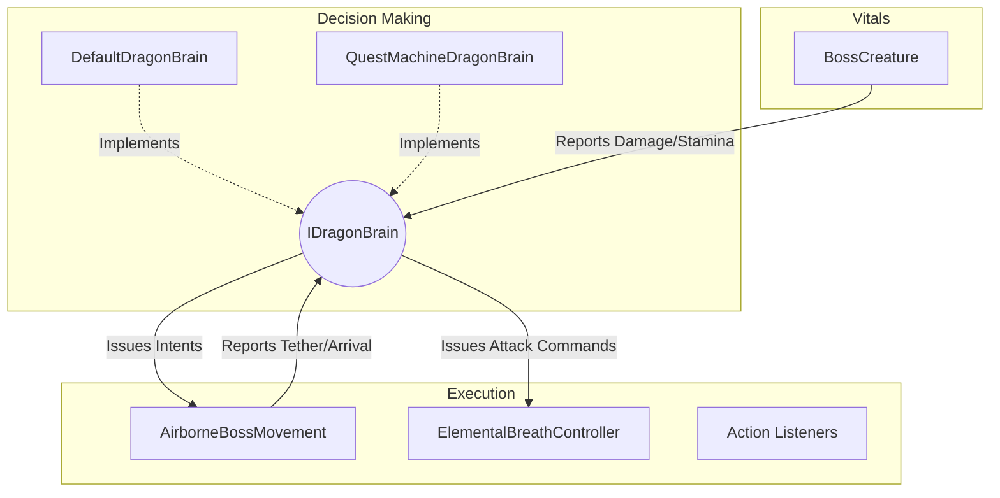

# Dragon Boss AI & Quest Machine Integration

## High-Level Concept

In this project, we are creatively using **Quest Machine** (a popular asset by PixelCrushers) not for a traditional player-facing quest log, but as a visual, node-based **Combat AI State Machine** for our bosses (e.g., the Dragon).

Instead of writing complex, hard-to-maintain state machine logic in C#, we use Quest Machine's node editor to visually design the boss's behavior.

- **Quest Nodes** represent the **AI States** (e.g., Scan, AttackCrystal, Swoop, ToppleObject, Reposition).
- **Node Conditions** act as **Transition Rules** (determining when the boss leaves a state and enters another).
- **Node Actions** define what the boss **does** when entering or during that state (such as playing an animation, moving, or triggering an attack).

The Quest Machine is completely invisible to the player—there is no UI or HUD tracker. While the concept is solid, our initial implementation resulted in tight coupling and mixed responsibilities. Below is a breakdown of our first attempt, its flaws, and the optimal modular architecture we are moving towards.

---

## Phase 1: The First Attempt (Current Implementation)

Our initial approach proved that Quest Machine could drive AI, but the engineering was messy and resulted in classes taking on double responsibilities.

### The Components

1. **`DragonBrainController` (The Engine)**
   - **Role:** Loads and clones the `Quest` asset, adding it to an invisible `QuestJournal` to kick off the behavior sequence.
   - **Looping:** AI looping is handled inside the graph using "Set Quest Node State" actions to flip previous nodes back to `Active`.

2. **The Message System Bridge**
   - **Role:** When a node in Quest Machine becomes active, its actions send predefined messages (e.g., Target: `"DragonActions"`, Parameter: `"Pursuit"`).

3. **`DragonActionListeners` (The Muscles / Command Router)**
   - **Role:** Acts as a massive `switch` statement that listens for `"DragonActions"` messages.
   - **The Flaw:** It is too deeply involved in multiple domains. For example, when it receives a command, it simultaneously commands movement (`AirborneBossMovement`), triggers attacks (`ElementalBreathController`), and manually alters the phase in `BossCreature`.

4. **`BossCreature` (Vitals & Accidental Decision Maker)**
   - **Role:** Manages Health, Stamina, and Phase state (`Orchestrator`, `Engaged`, `Exhausted`, `Recharging`).
   - **The Flaw (Double Responsibility):** It manages vitals but *also* overrides AI decisions. For instance, in `Update()`, it drains stamina and decides to force an evasion. When taking damage, it evaluates threat and commands immediate evasion. This subverts the Quest Machine, meaning the "brain" is no longer the sole source of truth.

5. **`AirborneBossMovement` (Movement Execution + Fragmented Logic)**
   - **Role:** Executes flight intents (`Pursue`, `Bank`, `Stillhold`) and path follow blending.
   - **The Flaw:** Instead of purely executing movement, it independently queries `BossCreature.currentPhase` and `BossCreature.GetCurrentHealthPct()` in its `Update()` loop to decide where to position its targets.

### Why It's Messy
- **No Single Source of Truth:** Decision-making is fractured across Quest Machine, `BossCreature`, and `AirborneBossMovement`.
- **Tight Coupling:** The system isn't modular. If we want to test a simple programmatic AI instead of Quest Machine, we have to tear out or bypass hardcoded logic scattered across multiple classes.

---

## Phase 2: The Optimal Solution (Architectural Evolution)

To resolve the messiness, the Quest Machine integration is being ripped out and rebuilt into a highly modular, decoupled architecture. The goal is to separate concerns strictly: **Vitals**, **Decisions**, and **Execution**.

### Introducing `IDragonBrain`

The centerpiece of this refactor is the `IDragonBrain` interface. It acts as the *only* entity allowed to make decisions.

### The Clean Responsibilities

1. **`BossCreature` (Pure Vitals):**
   - Strictly manages Health, Stamina, and Status Effects.
   - **Change:** It no longer calls `ForceImmediateEvasion()`. Instead, it simply raises an event: `Brain.OnDamageThresholdReached()`. It is up to the Brain to decide if the boss should flee or rage.

2. **`AirborneBossMovement` (Pure Executor):**
   - Strictly handles moving the transform smoothly based on a requested intent (`RequestFreestyleIntent`).
   - **Change:** It no longer queries `BossCreature` for health or phase. All internal decision logic is removed. It just flies where the Brain tells it to fly.

3. **`IDragonBrain` (The Single Source of Truth):**
   - Receives events from `BossCreature` (e.g., stamina empty, high damage taken).
   - Receives events from the world (e.g., player attached tether).
   - Translates these events into actionable commands sent to the executors.

### How Quest Machine Plugs In

With this architecture, the system is fully modular.
- We can run a `DefaultDragonBrain` for simple testing without Quest Machine.
- When we plug in the `QuestMachineDragonBrain` (which implements `IDragonBrain`), it simply pipes the reported events (e.g., `OnTetherAttached`) directly into the Quest Machine graph as conditions.
- The Quest Machine nodes process the conditions, transition states, and send action commands out to the pure executors.

This optimal solution guarantees that our visual node graph is the undisputed master of the boss's behavior, while keeping the underlying C# codebase clean, extensible, and easy to debug.
