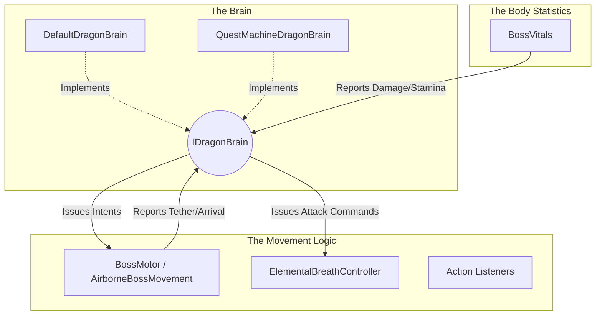

# Dragon Boss AI & Quest Machine Integration

## High-Level Concept

In this project, we are creatively using **Quest Machine** (a popular asset by PixelCrushers) not for a traditional player-facing quest log, but as a visual, node-based **Combat AI State Machine** for our bosses (e.g., the Dragon).

Instead of writing complex, hard-to-maintain state machine logic in C#, we use Quest Machine's node editor to visually design the boss's behavior.

- **Quest Nodes** represent the **AI States** (e.g., Scan, AttackCrystal, Swoop, ToppleObject, Reposition).
- **Node Conditions** act as **Transition Rules** (determining when the boss leaves a state and enters another).
- **Node Actions** define what the boss **does** when entering or during that state (such as playing an animation, moving, or triggering an attack).

The Quest Machine is completely invisible to the player. While the concept is solid, our initial implementation resulted in tight coupling, mixed responsibilities, and confusing naming conventions. Below is a breakdown of our first attempt, its flaws, and the optimal modular architecture we are moving towards.

---

## Phase 1: The First Attempt (Current Implementation)

Our initial approach proved that Quest Machine could drive AI, but the engineering was messy. The biggest issue stems from confusing naming and a lack of proper delineation between the containers for body statistics, movement logic, and the brain itself.

### The Components

1. **`DragonBrainController` (The Engine)**
   - **Role:** Loads and clones the `Quest` asset, adding it to an invisible `QuestJournal` to kick off the behavior sequence.

2. **`DragonActionListeners` (The Message Router)**
   - **Role:** Listens for `"DragonActions"` messages from the Quest Machine and delegates them.
   - **The Flaw:** It is too deeply involved in multiple domains, manually commanding movement logic, firing breath attacks, and altering phases directly in the body statistics.

3. **`BossCreature` (The Confusing Naming)**
   - **Role:** Currently manages Health, Stamina, and Phase state (`Orchestrator`, `Engaged`, `Exhausted`, `Recharging`).
   - **The Flaw (Naming & Responsibility):** The name `BossCreature` implies it represents the *entire entity* (Brain + Body Statistics + Movement Logic). However, it only acts as a container for body statistics and state. To make matters worse, it bleeds into decision-making (e.g., it decides to force an evasion when stamina drains or damage is high). This subverts the Quest Machine, meaning the actual "brain" is no longer the single source of truth.

4. **`AirborneBossMovement` (Movement Execution + Fragmented Logic)**
   - **Role:** Executes flight intents (`Pursue`, `Bank`, `Stillhold`) and path follow blending.
   - **The Flaw:** Instead of purely acting as a container for movement logic, it independently queries `BossCreature.currentPhase` and `BossCreature.GetCurrentHealthPct()` in its `Update()` loop to decide where to fly.

### Why It's Messy
- **No Intuitive Delineation:** The separation between the container for physical body statistics, the container for movement logic, and the central brain is blurred.
- **Double Responsibility:** Classes like `BossCreature` act as both a body statistics container and an AI override.

---

## Phase 2: The Optimal Solution (Architectural Evolution)

To resolve the messiness, we must rebuild the architecture with intuitive delineation. A boss logically consists of three distinct concepts: **The Container for Body Statistics**, **The Container for Movement Logic**, and **The Brain**.

### Introducing the Triad Architecture

We will rename and restructure the classes to enforce strict boundaries based on these three concepts.

### The Clean Responsibilities

1. **The Body Statistics (Replacing `BossCreature` with `BossVitals`):**
   - **Role:** Purely acts as the container for the body statistics (Health, Stamina, Status Effects).
   - **Change:** It no longer makes decisions like `ForceImmediateEvasion()`. If stamina hits zero, it simply fires an event (`OnStaminaDepleted`). It makes no decisions; it just holds statistics and takes damage. The name `BossVitals` intuitively clarifies that this is just the statistical shell, not the whole creature.

2. **The Movement Logic (Refactoring `AirborneBossMovement`):**
   - **Role:** Purely handles physical locomotion. It knows *how* to move, but lacks the *reason* to move. It knows how to do freestyle flight, how to transition from freestyle onto an escape spline, how to move toward or away from the player, and how to use the splines in the environment. It does not know *why* it is doing those things; it simply executes them.
   - **Change:** It no longer queries the Body Statistics for health or phase. All internal decision logic is removed. It only executes movement logic when commanded by the Brain (e.g., `RequestFreestyleIntent`).

3. **The Brain (`IDragonBrain`):**
   - **Role:** The entity's comprehension of the environment, the undisputed master of behavior, and the single source of truth.
   - **Change:** It receives physical events from the Body Statistics container (e.g., high damage taken) and spatial/world events from the Movement Logic container (e.g., player attached tether, arrived at destination). It processes these inputs and issues commands back to the Body and Movement systems.

### How Quest Machine Plugs In

With this architecture, the system is fully modular.
- We can run a `DefaultDragonBrain` (pure C# logic) for simple testing.
- When we plug in the `QuestMachineDragonBrain` (which implements `IDragonBrain`), it simply pipes the reported events (e.g., `OnStaminaDepleted`, `OnTetherAttached`) directly into the Quest Machine graph as conditions.
- The Quest Machine nodes process these conditions, transition states, and send action commands out to the pure executors (the Movement Logic and the Body Statistics).

This optimal solution guarantees that our naming makes intuitive sense, and our visual node graph remains the strict, decoupled master of the boss's behavior.
