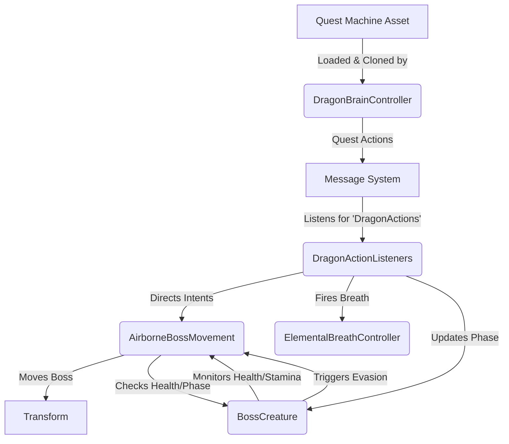

# Dragon Boss AI & Quest Machine Integration

## High-Level Overview

The current Dragon Boss AI relies on a hybrid architecture. It creatively uses **Quest Machine** (a visual node-based editor by PixelCrushers) as a Combat AI State Machine rather than a traditional player-facing quest log. However, decision-making is currently split between the Quest Machine nodes, the `BossCreature` class (which manages health, stamina, and phase transitions), and the `AirborneBossMovement` class (which manages flight intents).

The Quest Machine is completely invisible to the player—there is no UI or HUD tracker. The `DragonBrainController` loads this "quest" behind the scenes, and the boss executes it to fight the player.

The goal of this architecture is to visually design boss behavior, but it currently has tight coupling. Understanding the current flow is essential for the future refactor, which will introduce an `IDragonBrain` interface to centralize decision-making and make movement scripts pure executors.

---

## System Diagram (Current Architecture)

---

## Component Breakdown & Decision Making

### 1. `DragonBrainController` (The State Machine Engine)
This script is responsible for initializing and running the state machine.
- **Role:** Holds the `Quest` asset (`dragonBrainAsset`) which acts as the blueprint.
- **Decision:** It does not make combat decisions. It merely clones the quest asset upon spawning (so multiple dragons have independent states) and adds it to an invisible `QuestJournal` to kick off the node sequence.
- **Looping:** AI looping is handled *inside* Quest Machine. When a state finishes, a "Set Quest Node State" action flips previous nodes back to `Active`, creating infinite combat loops without restarting the quest.

### 2. The Message System Bridge
To decouple the Quest Machine from Unity components, we use the **PixelCrushers MessageSystem**.
- **Role:** When a node in Quest Machine becomes active, its **Actions** send out predefined messages (e.g., Target: `"DragonActions"`, Message/Parameter: `"Swoop"` or `"Pursuit"`).
- **Decision:** None. It acts purely as a transport layer.

### 3. `DragonActionListeners` (The Muscles / Command Router)
This script acts as the receiver for messages sent by the Quest Machine.
- **Role:** It acts as a massive `switch` statement based on the action command.
- **Decision:** It interprets the commands and updates internal states. For example, if it receives `"Swoop"`, it sets the `BossCreature` phase to `Engaged`, tells `AirborneBossMovement` to change intent to `Pursue`, and commands `ElementalBreathController` to fire.

### 4. `BossCreature` (The Core State & Vitals Manager)
This is a core class that currently mixes vitals tracking with some decision-making logic.
- **Role:** Manages Health, Stamina, Phase state (`Orchestrator`, `Engaged`, `Exhausted`, `Recharging`), and elemental damage modifiers.
- **Decision:**
  - **Stamina Drain:** In `Update()`, if the phase is `Engaged`, it drains stamina. If stamina hits 0, it decides to enter the `Exhausted` phase and commands the movement system to evade.
  - **Threat Evaluation:** When taking damage, it evaluates if recent burst damage exceeds a threshold (`evasionDamageThreshold`). If so, it overrides the current behavior and calls `ForceImmediateEvasion()`.

### 5. `AirborneBossMovement` (Movement Execution + Fragmented Logic)
This script handles the physical movement of the dragon, supporting Spline mode (observation/escape) and Freestyle mode (pursue, swoop).
- **Role:** Executes movement intents (`Pursue`, `Bank`, `Stillhold`) and smoothly blends the dragon onto splines.
- **Decision:** Currently, this script makes autonomous decisions by querying `BossCreature`. For example, inside its tether struggle logic or its `Update()` loop, it checks `bossBrain.currentPhase` and `bossBrain.GetCurrentHealthPct()` to decide where to position the `freestyleTargetPosition`.

---

## Extending for the Future: The `IDragonBrain` Refactor

Currently, decision-making is entangled. `BossCreature` forces evasion based on damage, Quest Machine commands intents via `DragonActionListeners`, and `AirborneBossMovement` makes positional decisions by querying `BossCreature`'s health.

### Future Architecture Vision

To resolve this, we will introduce the `IDragonBrain` interface.

1. **Pure Executors:** `AirborneBossMovement` will be stripped of all decision logic. It will no longer query `BossCreature` for health or phase. It will strictly execute intents (`RequestFreestyleIntent`, `RequestGlideToSpline`) provided to it.
2. **Centralized Brain:** `IDragonBrain` will serve as the single entry point for all decision-making.
3. **Event Reporting:** Executors will report events (e.g., `OnTetherAttached(Transform anchor)`, `OnDamageTaken(float amount)`) to the `IDragonBrain`.
4. **Modular Implementation:** We can swap brains easily. A `DefaultDragonBrain` can run the standard C# logic, while a `QuestMachineDragonBrain` will pipe these events into the Quest Machine, allowing the node graph to dictate the exact response (e.g., node condition: `If Tethered -> Transition to Swoop`).

This architectural shift will solidify Quest Machine as the sole dictator of behavior, making the system highly modular and predictable.
