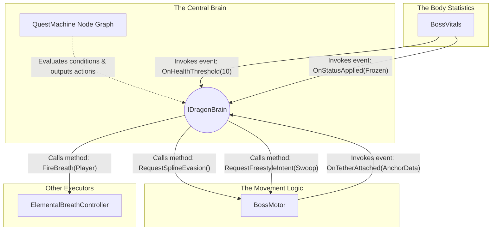

# Dragon Boss AI & Quest Machine Integration

## Technical Overview

This project uses **Quest Machine** (by PixelCrushers) as a visual, node-based **Combat AI State Machine** to control boss behavior (e.g., the Dragon).

Instead of writing state machine logic in C#, the boss's behavior is designed in Quest Machine's node editor.

- **Quest Nodes** represent the **AI States** (e.g., Scan, AttackCrystal, Swoop, ToppleObject, Reposition).
- **Node Conditions** act as **Transition Rules** (determining when the boss leaves a state and enters another).
- **Node Actions** define what the boss **executes** when entering or during that state (such as playing an animation, moving, or triggering an attack).

The Quest Machine UI is disabled. The `DragonBrainController` loads this "quest" in the background, and the boss executes it to fight the player. Below is a breakdown of our first iteration, its technical flaws, and the refactored modular architecture we are adopting.

---

## Phase 1: The First Attempt (Current Implementation)

Our initial approach proved that Quest Machine could drive AI, but the implementation tightly coupled systems and mixed class responsibilities.

### The Components

1. **`DragonBrainController`**
   - **Role:** Instantiates the `Quest` asset, adding it to a `QuestJournal` component to start the node sequence.

2. **`DragonActionListeners`**
   - **Role:** Listens for `"DragonActions"` strings broadcast by the Quest Machine Message System.
   - **The Flaw:** It is heavily coupled. It receives a macro-string like `"Swoop"`, then manually alters phase states in `BossCreature`, triggers attacks on `ElementalBreathController`, and dictates movement on `AirborneBossMovement`.

3. **`BossCreature`**
   - **Role:** Tracks numeric values (Health, Stamina) and an enum state (`BossPhase`).
   - **The Flaw:** It mixes variable tracking with combat logic overrides. For example, in its `Update()` loop, if stamina hits zero, it triggers a function to force an evasion. This bypasses the Quest Machine entirely, splitting the AI logic into two separate locations.

4. **`AirborneBossMovement`**
   - **Role:** Moves the transform using flight intents (`Pursue`, `Bank`, `Stillhold`) and spline followers.
   - **The Flaw:** Instead of purely receiving movement coordinates, it contains its own logic checks. It queries `BossCreature.currentPhase` and `BossCreature.GetCurrentHealthPct()` internally to calculate where it should fly.

### Architectural Flaws
- **Scattered AI Logic:** The combat logic is split between Quest Machine nodes, `BossCreature` overrides, and `AirborneBossMovement` calculations.
- **Coupling:** Classes cannot function independently. Movement relies on Health data, and Health data triggers Movement.

---

## Phase 2: The Optimal Solution (Architectural Evolution)

To fix the coupling and scattered logic, the architecture is being rebuilt into three strictly separated components: **The Container for Body Statistics**, **The Container for Movement Logic**, and **The Central Brain**.

The goal is to ensure the Quest Machine node graph is the exclusive location where combat logic is processed.

### Technical Responsibilities & Data Flow

To eliminate ambiguity, here is exactly what each script does and how data passes between them.

#### 1. The Body Statistics (`BossVitals`)
- **Role:** A data container for floats (Health, Stamina) and enums (Status Effects).
- **What it does:** It runs the math when damage is taken. When a value crosses a specific threshold (e.g., Stamina drops to 0), it invokes a C# event. It contains zero logic for deciding how the boss should react to that damage.
- **Example Flow:**
  - Player shoots an Ice Arrow.
  - `BossVitals` subtracts the float value and sets the status to `Frozen`.
  - `BossVitals` fires an event: `OnFrozenStatusApplied()`.

#### 2. The Movement Logic (`BossMotor`)
- **Role:** A script that manipulates `transform.position` and `transform.rotation`.
- **What it does:** It contains the mathematical formulas required to move the object. It calculates how to orbit a spline, how to lerp towards a target (freestyle), and how to calculate a vector moving away from the player. It does not decide *when* to execute these formulas. It relies entirely on the Central Brain to call its public methods and provide the target destination.
- **Example Flow:**
  - The player successfully attaches a tether to the boss.
  - `BossMotor` detects the physics collision and fires an event: `OnTetherAttached()`.
  - It then waits at its current position until a method is called.

#### 3. The Central Brain (`IDragonBrain` & `QuestMachineDragonBrain`)
- **Role:** The script that connects the C# events to the Quest Machine node graph, and connects the Quest Machine outputs to the C# methods.
- **What it does:** It subscribes to the events fired by `BossVitals` and `BossMotor`. When an event fires, it updates the corresponding variable inside the Quest Machine's data structures. Quest Machine then evaluates its node conditions. If a condition is met, Quest Machine outputs Actions.

---

### Replacing `DragonActionListeners`: Achieving Uncoupled Behavior

In Phase 1, a Quest Machine node output a single string (e.g., `"Swoop"`). The `DragonActionListeners` script caught that string, parsed it in a switch statement, and then hardcoded calls to the Movement, Breath, and Phase systems. This is what caused the heavy coupling.

To achieve all of the exact same functionality while keeping systems completely ignorant of each other, we move the **composition** of the behavior out of C# and into the Quest Machine Node UI.

Instead of outputting a generic string, the `QuestMachineDragonBrain` implementation defines **Atomic Custom Quest Actions**. These atomic actions target one specific system via an interface or direct method call.

**Concrete Orchestration Example (Executing a "Swoop"):**
- **Inside the Quest Machine UI**, the designer clicks the "Swoop" node.
- In the **Actions** list for that node, the designer adds three distinct, atomic actions:
  1. `SetMotorIntentAction (Intent: Pursue, Target: Player)`
  2. `FireWeaponAction (Type: FireBreath, Target: Player)`
  3. `SetPhaseAction (Phase: Engaged)`
- **Execution Output:** When the node becomes active, Quest Machine executes the three actions sequentially.
  - Action 1 locates `BossMotor` and calls `RequestFreestyleIntent(Pursue, Player)`.
  - Action 2 locates `ElementalBreathController` and calls `FireBreath(Fire, Player)`.
  - Action 3 locates the orchestration system and updates the Phase.

**The Result:** The Boss successfully executes a complex Swoop behavior (moving, attacking, and changing state simultaneously). However, `BossMotor` has no idea that the `ElementalBreathController` fired, and neither of them knows what the `Phase` is. The logic resides 100% in the visual node graph, and the C# classes are fully uncoupled.
