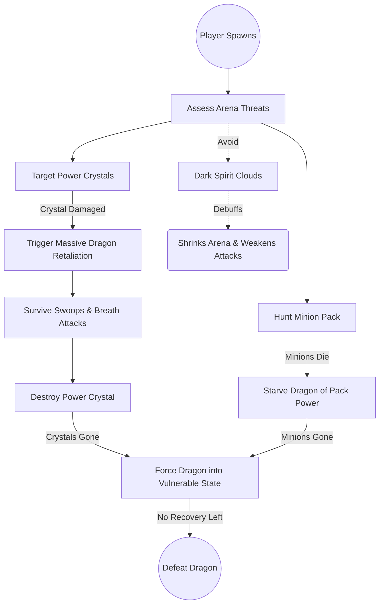
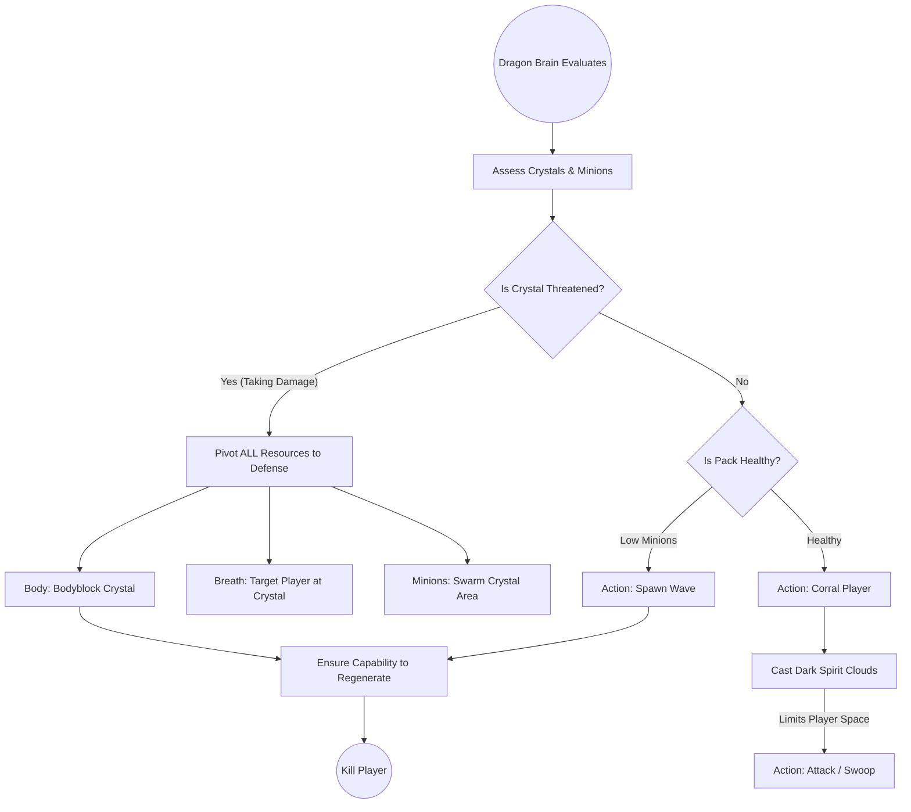
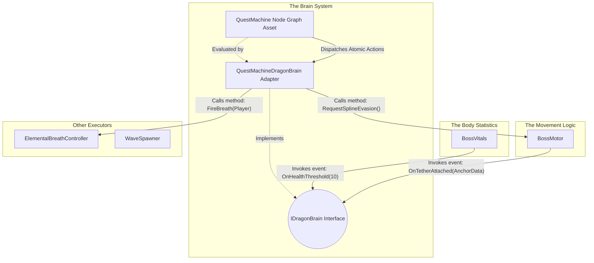
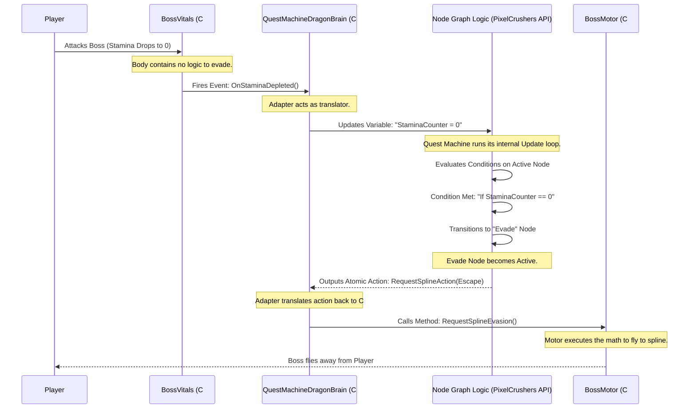
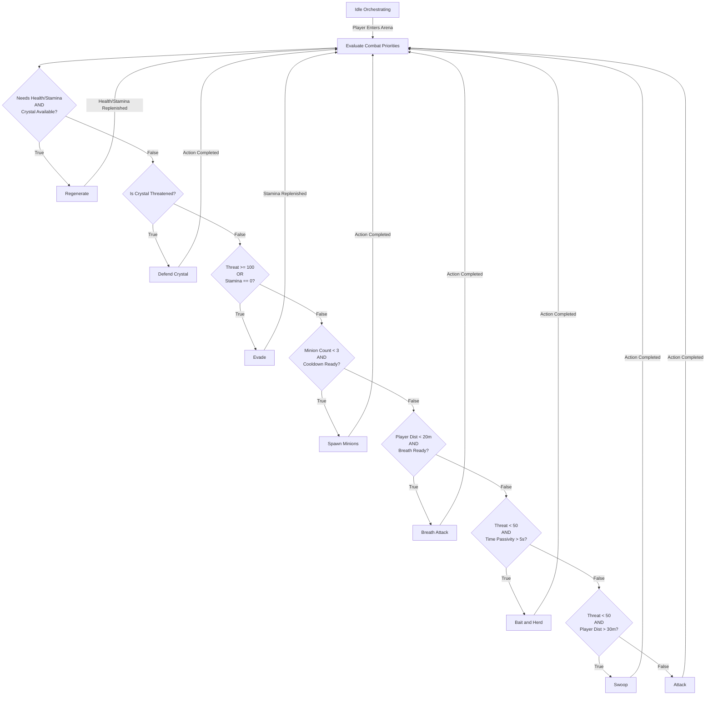

# Dragon Boss AI & Quest Machine Integration

## High-Level Concept

In this project, we are creatively using **Quest Machine** (a popular asset by PixelCrushers) not for a traditional player-facing quest log, but as a visual, node-based **Combat AI State Machine** for our bosses (e.g., the Dragon).

Instead of writing complex, hard-to-maintain state machine logic in C#, we use Quest Machine's node editor to visually design the boss's behavior.

- **Quest Nodes** represent the **AI States** (e.g., Scan, AttackCrystal, Swoop, ToppleObject, Reposition).
- **Node Conditions** act as **Transition Rules** (determining when the boss leaves a state and enters another).
- **Node Actions** define what the boss **executes** when entering or during that state (such as playing an animation, moving, or triggering an attack).

The Quest Machine UI is disabled. The `DragonBrainController` loads this "quest" in the background, and the boss executes it to fight the player. Below is a breakdown of our first iteration, its technical flaws, and the refactored modular architecture we are adopting.

---

## Combat Dynamics & Objectives: Player vs. Dragon

Before delving into the technical architecture, it is critical to understand the overarching design of the fight. The entire game hinges on two opposing sets of priorities. The Player and the Dragon are engaged in a war of attrition over supply lines.

**The Player wants to:**
- Destroy the Power Crystals — the main objective. Each crystal is a lifeline to the Dragon.
- Pick off minions — the secondary objective. Every minion killed steals a small amount of power from the Dragon.
- Force the Dragon into a state where it can't recharge — no crystals, no minions, no recovery.
- Survive long enough to do all three.

**The Dragon wants to:**
- Protect the Power Crystals — they're the reason it can keep regenerating segments and health.
- Keep its minion count up — the pack feeds it.
- Corral the player with Dark Spirit Clouds — shrink the arena, obscure itself and its minions, weaken the player's attacks.
- Kill the player before the player cuts the supply lines.
- When the player threatens a crystal, pivot *everything* to defending it — minions, breath, body.

The two sides are in direct opposition. The player's priorities are the Dragon's priorities, inverted.

To visualize how these mechanics play out systemically, here are two flowcharts representing the fight from each perspective.

### The Player's Point of View

### The Dragon's Point of View (Orchestrated by the Brain)

---

## Phase 1: The First Attempt (Current Implementation)

Our initial approach proved that Quest Machine could drive AI, but the implementation tightly coupled systems and mixed class responsibilities. Every flaw in this design has been addressed by the new architecture.

### The Components

1. **`DragonBrainController`**
   - **Role:** Instantiates the `Quest` asset, adding it to a `QuestJournal` component to start the node sequence.

2. **`DragonActionListeners`**
   - **Role:** Listens for `"DragonActions"` strings broadcast by the Quest Machine Message System.
   - **The Flaw:** It is heavily coupled. It receives a macro-string like `"Swoop"`, then manually alters phase states in `BossCreature`, triggers attacks on `ElementalBreathController`, and dictates movement on `AirborneBossMovement`.
   - **The Solution:** The `DragonActionListeners` script is deleted entirely. In the new system, we use Atomic Custom Actions inside the Quest Machine UI. A node now simply fires independent actions (`SetPhase`, `SetMotorIntent`, `FireWeapon`), allowing the behaviors to execute simultaneously without the C# scripts ever referencing or knowing about each other.

3. **`BossCreature`**
   - **Role:** Tracks numeric values (Health, Stamina) and an enum state (`BossPhase`).
   - **The Flaw:** It mixes variable tracking with combat logic overrides. For example, in its `Update()` loop, if stamina hits zero, it triggers a function to force an evasion. This bypasses the Quest Machine entirely, splitting the AI logic into two separate locations.
   - **The Solution:** We replace this with `BossVitals`. When stamina hits zero in the new system, it merely fires an `OnStaminaDepleted()` event. The Quest Machine receives this event, updates its variables, and the Node Graph evaluates the condition to decide what to do. This ensures that 100% of the combat logic is consolidated visibly within the node editor, making the AI predictable and easy to adjust.

4. **`AirborneBossMovement`**
   - **Role:** Moves the transform using flight intents (`Pursue`, `Bank`, `Stillhold`) and spline followers.
   - **The Flaw:** Instead of purely receiving movement coordinates, it contains its own logic checks. It queries `BossCreature.currentPhase` and `BossCreature.GetCurrentHealthPct()` internally to calculate where it should fly.
   - **The Solution:** We replace this with `BossMotor`. The motor is completely stripped of AI queries. It waits for the Brain to provide an intent and a target (e.g., `RequestFreestyleIntent(Pursue, Player)`). This benefits the architecture by making the movement logic entirely reusable for any boss or creature, as it no longer relies on specific boss state variables.

---

## Phase 2: The Optimal Solution (Architectural Evolution)

To fix the coupling and scattered logic, the architecture is being rebuilt into strictly separated components.

### Technical Responsibilities & Data Flow

#### 1. The Body Statistics (`BossVitals`)
- **Role:** A data container for floats (Health, Stamina) and enums (Status Effects).
- **What it does:** It runs the math when damage is taken. When a value crosses a specific threshold (e.g., Stamina drops to 0), it invokes a C# event. It contains zero logic for deciding how the boss should react to that damage.

#### 2. The Movement Logic (`BossMotor`)
- **Role:** A script that manipulates `transform.position` and `transform.rotation`.
- **What it does:** It contains the mathematical formulas required to move the object (freestyle math, spline math). It relies entirely on public methods being called to provide its target destination. It acts as a spatial sensor, firing events (e.g., `OnTetherAttached()`) when collisions occur.

#### 3. The Brain System (De-tangled)
In Phase 1, the "Brain" was a confusing mix of concepts. In Phase 2, it is strictly separated into three technical parts:

1. **`IDragonBrain` (The Interface):** This is just a C# contract. It guarantees that any class implementing it has methods like `OnDamageTaken(float amount)` and `OnStaminaDepleted()`. `BossVitals` and `BossMotor` only talk to this interface. They do not know Quest Machine exists.
2. **`QuestMachineDragonBrain` (The Adapter Script):** This is a C# script attached to the boss. It implements `IDragonBrain`.
   - **Input:** When `BossVitals` fires an event, this Adapter catches it, and mathematically updates the corresponding "Counter" or "Condition" variables *inside* the Quest Machine API.
   - **Output:** When Quest Machine executes an action, this Adapter translates that action into public method calls on the Motor and Body scripts.
3. **The Quest Machine Node Graph (The Logic Data):** This is the visual asset created in the Unity Editor. **This is where the actual combat strategy and decision-making exist.** It continuously evaluates the variables updated by the Adapter. When conditions are met, it changes nodes and outputs Actions back to the Adapter.

---

### Understanding the Sequence: How Events Drive the Node Graph

To fully grasp how this decoupled architecture works with Quest Machine, it is crucial to understand the chronological sequence of events. A static flowchart shows the *states*, but a **sequence diagram** shows *time*.

The C# classes (`BossVitals`, `BossMotor`) are completely ignorant of Quest Machine. They only shout into the void (fire C# events). The `QuestMachineDragonBrain` (Adapter) listens to those shouts and updates variables in Quest Machine. Quest Machine then evaluates those variables under the hood, transitions nodes, and spits actions back out.

Here is the exact timeline of a single decision (e.g., Evading due to low stamina):

#### Detailed Breakdown of Node Evaluations (The Full Life Cycle)
The sequence above shows the flow of time. Below is the comprehensive, static map of the nodes themselves, showing how the variables (updated by the Adapter in step 3 above) dictate the transitions. This covers the *entire* life cycle of the boss.

#### Explaining the Priority Evaluations
1. **Regenerate:** Adapter updates `NeedsHealing` based on `BossVitals` events. Node graph transitions if true.
2. **Defend Crystal:** Adapter updates `IsCrystalThreatened` based on global level events. Node graph transitions if true.
3. **Evade:** Adapter updates `ThreatLevel` based on `BossVitals` damage events. Node graph transitions if threat is too high.
4. **Spawn Minions:** Adapter updates `ActiveMinions` when minions die. Graph spawns more if the pack is depleted.
5. **Breath Attack:** Adapter updates `PlayerDistance` and `BreathCooldown`. Graph transitions if the player is in close range.
6. **Bait and Herd:** Adapter updates `TimeSinceLastDesire`. Graph repositions if the boss has been passive for too long.
7. **Swoop / Attack:** Based on `PlayerDistance` and `ThreatLevel`, the graph chooses between a fast swooping strike or a standard sustained attack.

---

### Proof of Concept: Uncoupling the Legacy Behaviors

To completely remove `DragonActionListeners` without losing functionality, we move the composition of behavior directly into the **Quest Machine Node UI** using **Atomic Custom Actions**.

In Phase 1, there was a lot of redundancy in the behavior names (e.g., "Bank" and "Swoop" were nearly identical, "Recharging" and "Regenerate" were duplicates). In the new architecture, we have tidied up these behaviors, giving them their real, intuitive names, and ensuring the entire life cycle of the creature is covered.

Below is the technical proof of concept demonstrating how the cleaned-up list of behaviors maps to uncoupled atomic actions inside the Quest Machine UI.

| The Cleaned-Up Behavior Name | What the Quest Machine Node UI Executes (The Atomic Actions List) |
| :--- | :--- |
| **Attack** *(formerly Pursuit)* | 1. `SetPhaseAction(Phase: Engaged)`   2. `SetMotorIntentAction(Intent: Pursue, Target: Player)` |
| **Swoop** *(merged with Bank)* | 1. `SetPhaseAction(Phase: Engaged)`   2. `SetMotorIntentAction(Intent: Pursue, Target: Player)`   3. `FireWeaponAction(Type: Fire, Target: Player)`   4. `StartCooldownAction(DesireType: Dominance)` |
| **Bait & Herd** *(merged Flank/Bait/Herd)* | 1. `SetPhaseAction(Phase: Engaged)`   2. `SetMotorIntentAction(Intent: Pursue, Target: Player)` |
| **Spawn Minions** *(merged SpawnWave/Circle)* | 1. `SpawnMinionAction(Intent: AllIn, Target: Player)`   2. `StartCooldownAction(DesireType: Attrition)` |
| **Breath Attack** | 1. `SetPhaseAction(Phase: Engaged)`   2. `FireWeaponAction(Type: Fire, Target: Player)`   3. `StartCooldownAction(DesireType: ElementalAdvantage)` |
| **Defend Crystal** | 1. `SetPhaseAction(Phase: Engaged)`   2. `RequestSplineAction(PathType: AirborneObservation)` |
| **Evade** | 1. `SetPhaseAction(Phase: Exhausted)`   2. `RequestSplineAction(PathType: AirborneEscape)` |
| **Regenerate** *(merged Recharging/Regenerate)* | 1. `SetPhaseAction(Phase: Recharging)`   2. `RequestSplineAction(PathType: AirborneObservation)`   3. `TriggerHealthRegenAction(Target: NearestCrystal)`   4. `TriggerSegmentRegrowthAction()`   5. `RefillMinionReserveAction()` |

**The Result:** The Boss successfully executes every complex behavior required for its life cycle—including regrowing body segments and recovering health. However, the `BossMotor` script has absolutely no idea that the `ElementalBreathController` fired or that segments grew back.

All logic and macro-behavior composition reside 100% inside the Quest Machine node graph, and the C# classes remain fully uncoupled and ignorant of each other.
