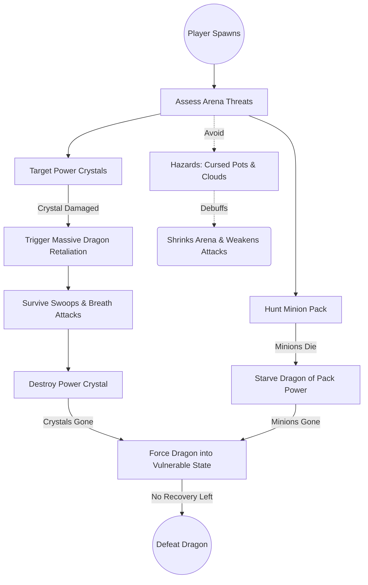
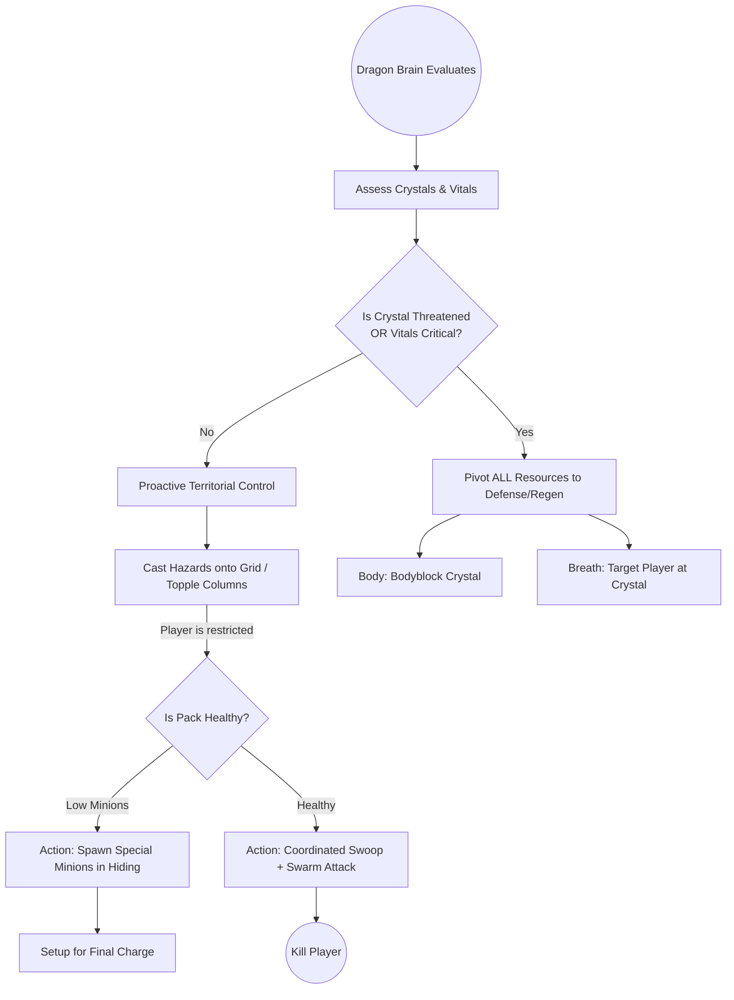
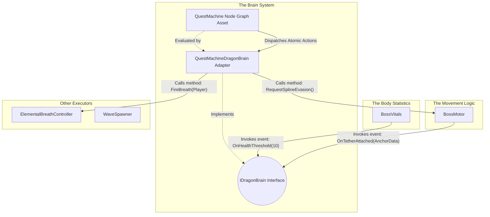
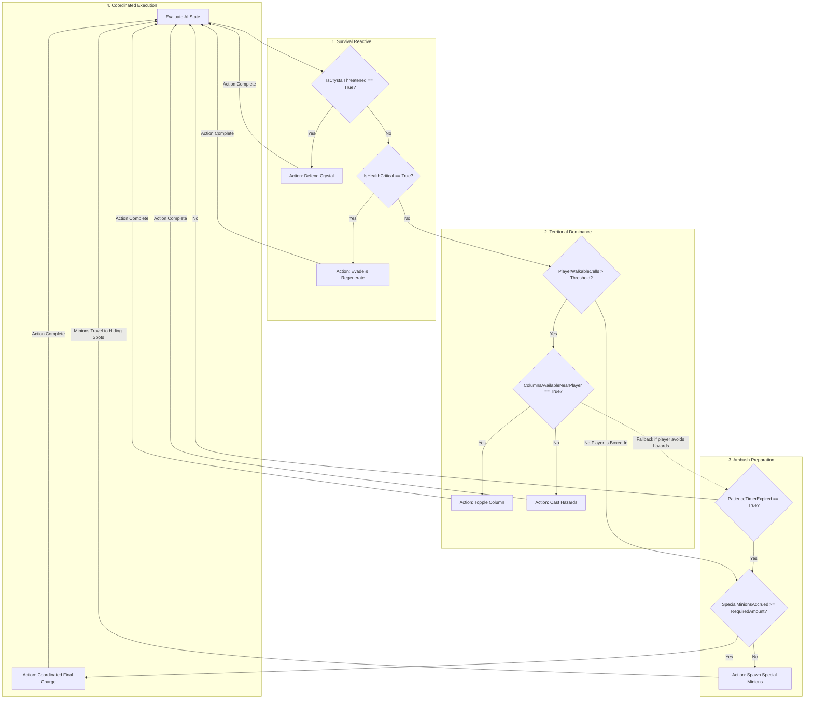
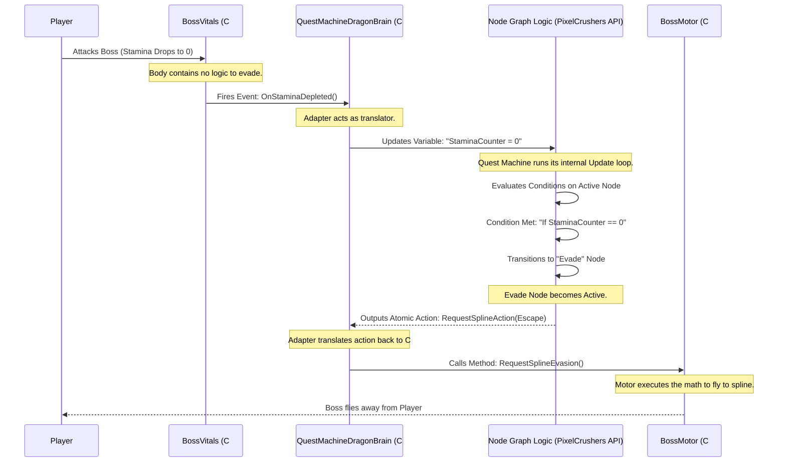

# Dragon Boss AI & Quest Machine Integration

## High-Level Concept

In this project, we are creatively using **Quest Machine** (a popular asset by PixelCrushers) not for a traditional player-facing quest log, but as a visual, node-based **Combat AI State Machine** for our bosses (e.g., the Dragon). 

Instead of writing complex, hard-to-maintain state machine logic in C#, we use Quest Machine's node editor to visually design the boss's behavior. 

- **Quest Nodes** represent the **AI States** (e.g., Scan, AttackCrystal, Swoop, ToppleObject, Reposition).
- **Node Conditions** act as **Transition Rules** (determining when the boss leaves a state and enters another).
- **Node Actions** define what the boss **executes** when entering or during that state (such as playing an animation, moving, or triggering an attack).

The Quest Machine UI is disabled. The `DragonBrainController` loads this "quest" in the background, and the boss executes it to fight the player. Below is a breakdown of our first iteration, its technical flaws, and the refactored modular architecture we are adopting.

---

## Combat Dynamics & Objectives: Player vs. Dragon

Before delving into the technical architecture, it is critical to understand the overarching design of the fight. The entire game hinges on two opposing sets of priorities. The Player and the Dragon are engaged in a war of attrition over supply lines and territorial control.

**The Player wants to:**
- Destroy the Power Crystals — the main objective. Each crystal is a lifeline to the Dragon.
- Pick off minions — the secondary objective. Every minion killed steals a small amount of power from the Dragon.
- Force the Dragon into a state where it can't recharge — no crystals, no minions, no recovery.
- Survive long enough to do all three.

**The Dragon wants to:**
- Protect the Power Crystals — they're the reason it can keep regenerating segments and health.
- **Maintain Territorial Control — shrink the arena and dictate the player's movement via Dark Spirit Clouds and Sticky Traps. (Sun Tzu: Control the battlefield, control the outcome).**
- Keep its minion count up — the pack feeds it and provides tactical pressure.
- Kill the player before the player cuts the supply lines.

The two sides are in direct opposition. To visualize how these mechanics play out systemically, here are two flowcharts representing the fight from each perspective.

### The Player's Point of View

### The Dragon's Point of View (Orchestrated by the Brain)

*Note: A commander does not wait for perfectly healthy forces to exert territorial dominance. Controlling the battlefield is a primary, proactive directive.*

---

## Phase 1: The First Attempt (Current Implementation)

Our initial approach proved that Quest Machine could drive AI, but the implementation tightly coupled systems and mixed class responsibilities. Every flaw in this design has been addressed by the new architecture.

### The Components

1. **`DragonBrainController`**
   - **Role:** Instantiates the `Quest` asset, adding it to a `QuestJournal` component to start the node sequence.

2. **`DragonActionListeners`**
   - **Role:** Listens for `"DragonActions"` strings broadcast by the Quest Machine Message System.
   - **The Flaw:** It is heavily coupled. It receives a macro-string like `"Swoop"`, then manually alters phase states in `BossCreature`, triggers attacks on `ElementalBreathController`, and dictates movement on `AirborneBossMovement`.
   - **The Solution:** The `DragonActionListeners` script is deleted entirely. In the new system, we use Atomic Custom Actions inside the Quest Machine UI. A node now simply fires independent actions (`SetPhase`, `SetMotorIntent`, `FireWeapon`), allowing the behaviors to execute simultaneously without the C# scripts ever referencing or knowing about each other.

3. **`BossCreature`**
   - **Role:** Tracks numeric values (Health, Stamina) and an enum state (`BossPhase`).
   - **The Flaw:** It mixes variable tracking with combat logic overrides. For example, in its `Update()` loop, if stamina hits zero, it triggers a function to force an evasion. This bypasses the Quest Machine entirely, splitting the AI logic into two separate locations.
   - **The Solution:** We replace this with `BossVitals`. When stamina hits zero in the new system, it merely fires an `OnStaminaDepleted()` event. The Quest Machine receives this event, updates its variables, and the Node Graph evaluates the condition to decide what to do. This ensures that 100% of the combat logic is consolidated visibly within the node editor, making the AI predictable and easy to adjust.

4. **`AirborneBossMovement`**
   - **Role:** Moves the transform using flight intents (`Pursue`, `Bank`, `Stillhold`) and spline followers.
   - **The Flaw:** Instead of purely receiving movement coordinates, it contains its own logic checks. It queries `BossCreature.currentPhase` and `BossCreature.GetCurrentHealthPct()` internally to calculate where it should fly. 
   - **The Solution:** We replace this with `BossMotor`. The motor is completely stripped of AI queries. It waits for the Brain to provide an intent and a target (e.g., `RequestFreestyleIntent(Pursue, Player)`). This benefits the architecture by making the movement logic entirely reusable for any boss or creature, as it no longer relies on specific boss state variables.

---

## Phase 2: The Optimal Solution (Architectural Evolution)

To fix the coupling and scattered logic, the architecture is being rebuilt into strictly separated components.

### Technical Responsibilities & Data Flow

#### 1. The Body Statistics (`BossVitals`)
- **Role:** A data container for floats (Health, Stamina) and enums (Status Effects).
- **What it does:** It runs the math when damage is taken. When a value crosses a specific threshold (e.g., Stamina drops to 0), it invokes a C# event. It contains zero logic for deciding how the boss should react to that damage.

#### 2. The Movement Logic (`BossMotor`)
- **Role:** A script that manipulates `transform.position` and `transform.rotation`.
- **What it does:** It contains the mathematical formulas required to move the object (freestyle math, spline math). It relies entirely on public methods being called to provide its target destination. It acts as a spatial sensor, firing events (e.g., `OnTetherAttached()`) when collisions occur.

#### 3. The Brain System (De-tangled)
In Phase 1, the "Brain" was a confusing mix of concepts. In Phase 2, it is strictly separated into three technical parts:

1. **`IDragonBrain` (The Interface):** This is just a C# contract. It guarantees that any class implementing it has methods like `OnDamageTaken(float amount)` and `OnStaminaDepleted()`. `BossVitals` and `BossMotor` only talk to this interface. They do not know Quest Machine exists.
2. **`QuestMachineDragonBrain` (The Adapter Script):** This is a C# script attached to the boss. It implements `IDragonBrain`. 
   - **Input:** When `BossVitals` fires an event, this Adapter catches it, and mathematically updates the corresponding "Counter" or "Condition" variables *inside* the Quest Machine API.
   - **Output:** When Quest Machine executes an action, this Adapter translates that action into public method calls on the Motor and Body scripts.
3. **The Quest Machine Node Graph (The Logic Data):** This is the visual asset created in the Unity Editor. **This is where the actual combat strategy and decision-making exist.** It continuously evaluates the variables updated by the Adapter. When conditions are met, it changes nodes and outputs Actions back to the Adapter.

---

## Discussion Point: Level Progression Waves vs. Dragon Tactical Minions

A critical architectural distinction must be made regarding how the Dragon spawns minions, and how this affects the core game loop.

Currently, the game's Level Progression relies on a "Clear the Wave" architecture: the level only advances when *all* enemies on the board are destroyed. 

If the Dragon spawns standard enemies and hides them intentionally (as part of its tactical strategy), the player will be unable to find them, and the level progression will completely stall. We cannot conflate automated level waves with the Dragon's tactical reserves.

**The Solution:**
1. **Automated Game Waves:** These are standard, un-strategic enemies designed to keep the player busy. When these are cleared, the game advances to the next wave phase.
2. **Dragon's Special Minions:** The Dragon must control a distinct, specialized type of minion (its own private spawn pool). These special minions are strategically placed by the Dragon, actively hide, and accrue numbers. **Crucially, the survival of these special minions must NOT block the core Level Progression.** The player can choose to hunt them down to weaken the Dragon's final charge, but failing to find them won't break the game.

This separation ensures the Dragon can execute complex staging tactics without ruining the global game flow.

---

## The Complete Master Logic: Unifying Reactive and Proactive Tactics

To truly understand how this architecture pulls everything together, we must look at the **Master Priority Logic** inside the Quest Machine node graph. 

The dragon does not just react to being hit; it proactively "thinks" about its environment in a highly aggressive, Sun Tzu-inspired manner. **Territorial control is the primary win condition.** The Dragon does not wait until its forces are fully healthy to exert dominance over the arena geometry. To do this, we attach a **Platform Grid Sensor** to the floor plane (e.g., dividing the arena into a 5x5 grid). This script provides the Dragon with a structural understanding of the battlefield.

The Quest Machine evaluates variables imported from this Grid Sensor (and other environmental signals) in a strict hierarchical order. **These are four distinct logic loops.** 

*(Note: The diagram below uses subgraph names and node labels that map exactly 1:1 with the logic described in the text.)*

### Explaining the Thought Process & Hierarchical Logic Loops

It is important to understand that **these are separate, hierarchical logic loops**. Quest Machine processes them top-down. 
If the conditions for Loop 1 (Survival) are not met, it falls down to Loop 2. If Loop 2 is satisfied, it executes that action and starts over. *If at any point during Ambush Preparation (Loop 3) the player manages to shoot a crystal, the AI immediately aborts the setup and falls back into Loop 1 (Survival).*

#### 1. Survival (Reactive)
Before doing anything else, the Dragon must secure its supply lines. 
- **The Evaluation:** The Brain checks `IsCrystalThreatened` and `IsHealthCritical`.
- **The Decision:** If its life or its crystal is in danger, it drops all tactical planning to aggressively **Defend the Crystal** or retreat to **Regenerate**.

#### 2. Territorial Dominance (Proactive Control)
*Crucially, the Dragon does NOT wait for its minion pack to be fully healthy to take control of the map.* If the Dragon is safe (Loop 1 passed), it immediately begins evaluating the arena geometry via the **Platform Grid Sensor** to establish territorial dominance.
- **The External Signal:** The grid script tracks exactly which cell (e.g., `Grid[2,2]`) the player is standing on, and which adjacent cells are currently occupied by obstacles or hazards. It broadcasts this state to the Adapter.
- **The Evaluation:** The Brain checks the spatial variable `PlayerWalkableCells`.
- **The Decision:** If the grid shows the player has too many open surrounding cells, the Dragon decides to strip those advantages. It checks `ColumnsAvailableNearPlayer`. If true, it executes an action to **Topple a Column**, cutting off player movement in that grid direction and creating a visual obstruction. If no columns are left, it targets specific open coordinates on the grid to cast **Hazards (Cursed Pots/Clouds)** to corral the player.

**Skill Expression & Gameplay Reward Design:** 
The hazard cast by the dragon is a "Cursed Pot" projectile. When it hits the ground, it smashes and releases Dark Spirit Clouds.
- A **clever player** is rewarded for shooting the cursed pot mid-air or avoiding the resulting cloud. They retain full weapon strength, allowing them to kill the dragon faster and achieve a higher score. This rewards active dodging and situational awareness.
- A **bad player** who fails to shoot the pot or walks directly into the Dark Spirit Cloud receives an incremental weapon strength debuff. They may still pass the level, but their damage output plummets, resulting in a much longer fight and a poor final score. *(Note: This debuff mechanism can be initially tested using a simple boolean flag in the player's stats to monitor how often they stand inside the cloud).*

#### 3. Ambush Preparation (Adversarial Resilience)
Once the player's movement and vision are crippled (Loop 2 passed), the Dragon uses that opportunity to prepare an overwhelming assault. However, a well-designed AI must be resilient. **It cannot permanently stall just because a skilled player successfully dodges all hazards and refuses to be boxed in.**
- **The Evaluation:** The Brain checks if the player is restricted (`PlayerWalkableCells < Threshold`). **Fallback Check:** If the player is *not* restricted, the Brain checks an internal `PatienceTimer`. If the timer expires, the Dragon decides it is done waiting and forces the next phase. It then checks the variable `SpecialMinionsAccrued`.
- **The Decision:** If minion numbers are low, the Dragon executes an action to **Spawn Special Minions**. These spawn near the Dragon, forcing the player to try and shoot them mid-air. If the minions survive the journey, they tuck themselves into inaccessible, hidden locations within the arena geometry, waiting for the command.

#### 4. Coordinated Execution
- **The Evaluation:** The Dragon is healthy (Loop 1), the player is either boxed in or the Dragon's patience has expired (Loops 2/3), and the Special Minion ambush wave is fully staged (`SpecialMinionsAccrued >= RequiredAmount`).
- **The Decision:** The conditions are perfect for the climax of the battle. The node transitions to the **Coordinated Final Charge**. The Dragon commands the hidden minion waves to emerge and swarm while simultaneously executing a heavy **Swoop** and firing **Elemental Breath**, catching the player in a devastating, multi-directional crossfire. Surviving this brutal wave is the key to advancing the phase.

---

## Dynamic Choreography: How the Battle Evolves

Because the Dragon relies on the player's status and its own resources to determine its flow through the logic loops, **the strategy will dynamically change over the course of the battle.** 

The player's core goals are to destroy crystals and kill minions to make the dragon vulnerable. As those factors change, the entire choreography of the battle naturally shifts without requiring heavily scripted "Phase 2" code.

**Scenario A: The Early Battle (High Resources)**
- **Variables:** `CrystalsAlive > 0`, `MinionReserves = High`.
- **Choreography:** The Dragon heavily relies on Loop 1 and Loop 3. It plays conservatively, fleeing to crystals to heal whenever its health dips, and safely spawning minions behind cover. The player is forced to aggressively hunt crystals while dealing with constant waves.

**Scenario B: The Late Battle (Supply Lines Cut)**
- **Variables:** `CrystalsAlive == 0`, `MinionReserves = Low/Depleted`.
- **Choreography:** The player has successfully destroyed the crystals and slaughtered the hidden reserves. 
- **The Shift:** Because there are no crystals left, the `IsCrystalThreatened` and `IsHealthCritical` (which normally triggers Regen) nodes in Loop 1 evaluate to False or execute a failed/desperate path. The Dragon can no longer heal. Because it cannot spawn massive ambush waves, Loop 3 is bypassed. 
- **The Desperation:** The Dragon is forced permanently into Loop 2 and Loop 4. The fight transforms from a strategic staging battle into a frantic, hyper-aggressive brawl. The Dragon ceaselessly topples pillars, casts clouds, and relentlessly Swoops because it has no other options left. 

This dynamic choreography is the ultimate benefit of the decoupled, node-based system. The Dragon's behavior evolves organically based on the environmental variables the player manipulates, ensuring a satisfying and escalating boss fight.

---

## Adversarial Design Audit: Identifying Exploits and Vulnerabilities

Because the AI's logic is hierarchical and highly structured, clever players will inevitably try to exploit holes in the priority loops to "break" the game or make it trivial. A robust, decoupled architecture must account for these exploits without hardcoding brittle fixes. 

Below is an adversarial analysis of the current Master Logic, identifying potential weaknesses and how our architecture naturally solves or mitigates them.

### Exploit 1: The "Spam the Crystal" Stunlock
**The Flaw:** If the player constantly shoots the Power Crystal with weak arrows, the Dragon's AI will get trapped in Loop 1 (Survival). Because Loop 1 always preempts Loop 2 (Tactical Control) and Loop 3 (Ambush Preparation), the Dragon would infinitely loop the `Defend Crystal` behavior, never spawning waves or executing a final charge. The player could effectively "stunlock" the boss's AI.
**The Mitigation:** This is naturally solved by the **Automated Game Waves** (discussed above). While the player is spamming the crystal, the global game manager continues to spawn regular enemies. These enemies will eventually swarm the player, forcing them to turn their attention away from the crystal to survive. This forced split-focus gives the Dragon the breathing room it needs to escape Loop 1 and proceed to tactical planning. 

### Exploit 2: The "Kite and Camp" (Hazard Avoidance)
**The Flaw:** In Loop 2, the Dragon tries to restrict the player's walkable area. What if a highly skilled player perfectly dodges every Cursed Pot, never gets hit by a Dark Spirit Cloud, and constantly repositions away from columns? The `PlayerWalkableCells` variable will never drop below the threshold required to trigger Loop 3 (Ambush Preparation). The Dragon would get trapped in Loop 2 forever, infinitely throwing pots and never advancing the fight.
**The Mitigation (The Patience Timer):** As shown in the Master Logic diagram, we introduce a **Patience Timer** fallback. If the Dragon fails to box the player in after a set amount of time, its patience expires. This acts as an OR condition bridging Loop 2 and Loop 3. Even if the player brilliantly evades every hazard, the Dragon will eventually say "enough is enough" and proceed to spawn ambush waves and launch the Final Charge anyway. This ensures progression is guaranteed and rewards the player for surviving the onslaught, rather than punishing them with a stalled game state.

### Exploit 3: The "Safe Corner" (Line of Sight Abuse)
**The Flaw:** If the player finds a specific corner of the arena grid where pillars cannot be toppled and clouds don't quite reach, they might establish a safe zone where the Final Charge (Loop 4) is ineffective because the Special Minions lack a path to reach them.
**The Architectural Strength:** Because our system is completely decoupled, fixing this requires zero changes to the C# movement scripts. We simply add a new **Atomic Custom Action** in Quest Machine: `SetMotorIntentAction(Intent: FlushOut)`. We then add a node condition: `If PlayerGridCell == UnreachableZone -> Execute FlushOut`. The Dragon will physically fly to that corner and use a targeted knockback breath attack to force the player back into the central grid. The node graph makes adapting to player exploits fast and visual.

By bashing out these vulnerabilities early, we prove that the hierarchical priority loops—combined with environmental data and global game pressures—create a resilient, fun, and exploitable-proof boss encounter.

---

### Understanding the Sequence: How Events Drive the Node Graph

To fully grasp how this decoupled architecture works with Quest Machine, it is crucial to understand the chronological sequence of events. A static flowchart shows the *states*, but a **sequence diagram** shows *time*.

The C# classes (`BossVitals`, `BossMotor`) are completely ignorant of Quest Machine. They only shout into the void (fire C# events). The `QuestMachineDragonBrain` (Adapter) listens to those shouts and updates variables in Quest Machine. Quest Machine then evaluates those variables under the hood, transitions nodes, and spits actions back out.

Here is the exact timeline of a single decision (e.g., Evading due to low stamina):

---

### Proof of Concept: Uncoupling the Legacy Behaviors

To completely remove `DragonActionListeners` without losing functionality, we move the composition of behavior directly into the **Quest Machine Node UI** using **Atomic Custom Actions**. 

In Phase 1, there was a lot of redundancy in the behavior names (e.g., "Bank" and "Swoop" were nearly identical, "Recharging" and "Regenerate" were duplicates). In the new architecture, we have tidied up these behaviors, giving them their real, intuitive names, and ensuring the entire life cycle of the creature is covered.

Below is the technical proof of concept demonstrating how the cleaned-up list of behaviors maps to uncoupled atomic actions inside the Quest Machine UI.

| The Cleaned-Up Behavior Name | What the Quest Machine Node UI Executes (The Atomic Actions List) |
| :--- | :--- |
| **Attack** *(formerly Pursuit)* | 1. `SetPhaseAction(Phase: Engaged)`   2. `SetMotorIntentAction(Intent: Pursue, Target: Player)` |
| **Swoop** *(merged with Bank)* | 1. `SetPhaseAction(Phase: Engaged)`   2. `SetMotorIntentAction(Intent: Pursue, Target: Player)`   3. `FireWeaponAction(Type: Fire, Target: Player)`   4. `StartCooldownAction(DesireType: Dominance)` |
| **Bait & Herd** *(merged Flank/Bait/Herd)* | 1. `SetPhaseAction(Phase: Engaged)`   2. `SetMotorIntentAction(Intent: Pursue, Target: Player)` |
| **Spawn Minions** *(merged SpawnWave/Circle)* | 1. `SpawnMinionAction(Intent: AllIn, Target: Player)`   2. `StartCooldownAction(DesireType: Attrition)` |
| **Breath Attack** | 1. `SetPhaseAction(Phase: Engaged)`   2. `FireWeaponAction(Type: Fire, Target: Player)`   3. `StartCooldownAction(DesireType: ElementalAdvantage)` |
| **Defend Crystal** | 1. `SetPhaseAction(Phase: Engaged)`   2. `RequestSplineAction(PathType: AirborneObservation)` |
| **Evade** | 1. `SetPhaseAction(Phase: Exhausted)`   2. `RequestSplineAction(PathType: AirborneEscape)` |
| **Regenerate** *(merged Recharging/Regenerate)* | 1. `SetPhaseAction(Phase: Recharging)`   2. `RequestSplineAction(PathType: AirborneObservation)`   3. `TriggerHealthRegenAction(Target: NearestCrystal)`   4. `TriggerSegmentRegrowthAction()`   5. `RefillMinionReserveAction()` |

**The Result:** The Boss successfully executes every complex behavior required for its life cycle—including regrowing body segments and recovering health. However, the `BossMotor` script has absolutely no idea that the `ElementalBreathController` fired or that segments grew back. 

All logic and macro-behavior composition reside 100% inside the Quest Machine node graph, and the C# classes remain fully uncoupled and ignorant of each other.
