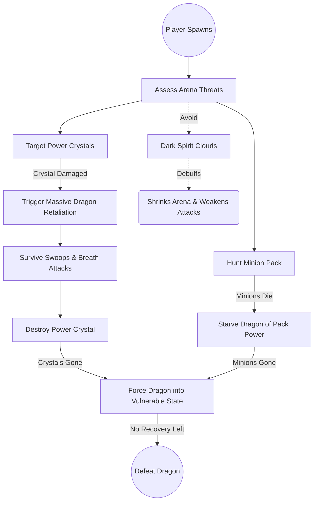
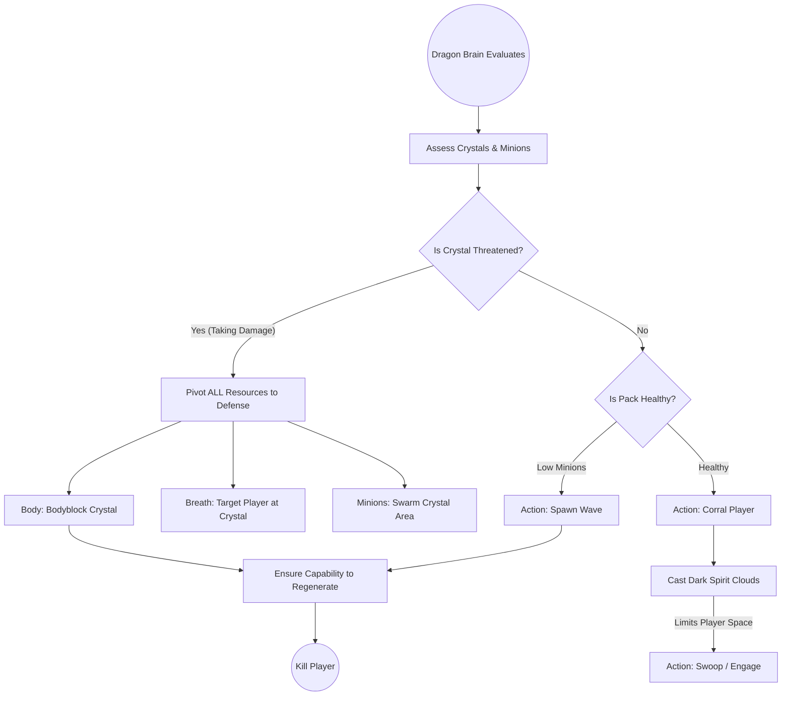
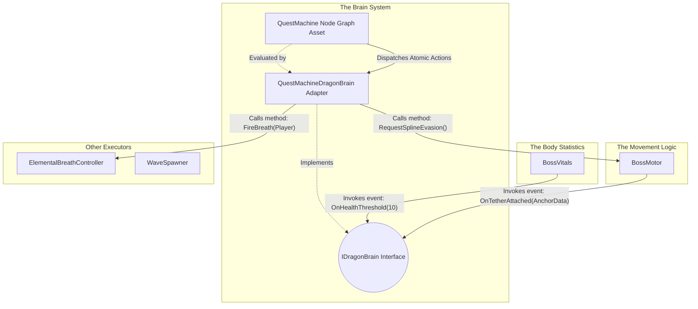
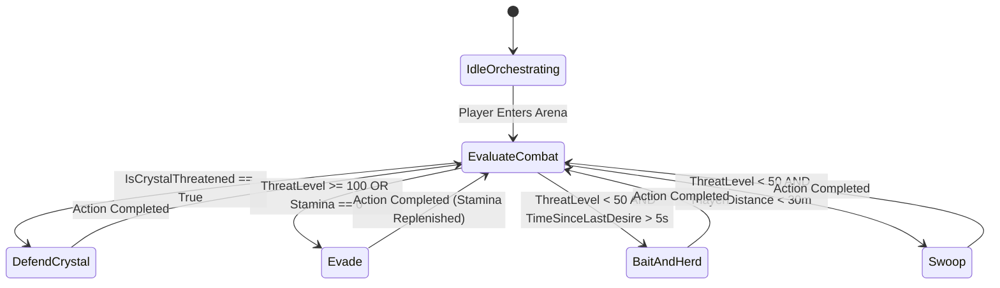

# Dragon Boss AI & Quest Machine Integration

## High-Level Concept

In this project, we are creatively using **Quest Machine** (a popular asset by PixelCrushers) not for a traditional player-facing quest log, but as a visual, node-based **Combat AI State Machine** for our bosses (e.g., the Dragon).

Instead of writing complex, hard-to-maintain state machine logic in C#, we use Quest Machine's node editor to visually design the boss's behavior.

- **Quest Nodes** represent the **AI States** (e.g., Scan, AttackCrystal, Swoop, ToppleObject, Reposition).
- **Node Conditions** act as **Transition Rules** (determining when the boss leaves a state and enters another).
- **Node Actions** define what the boss **executes** when entering or during that state (such as playing an animation, moving, or triggering an attack).

The Quest Machine UI is disabled. The `DragonBrainController` loads this "quest" in the background, and the boss executes it to fight the player. Below is a breakdown of our first iteration, its technical flaws, and the refactored modular architecture we are adopting.

---

## Combat Dynamics & Objectives: Player vs. Dragon

Before delving into the technical architecture, it is critical to understand the overarching design of the fight. The entire game hinges on two opposing sets of priorities. The Player and the Dragon are engaged in a war of attrition over supply lines.

**The Player wants to:**
- Destroy the Power Crystals — the main objective. Each crystal is a lifeline to the Dragon.
- Pick off minions — the secondary objective. Every minion killed steals a small amount of power from the Dragon.
- Force the Dragon into a state where it can't recharge — no crystals, no minions, no recovery.
- Survive long enough to do all three.

**The Dragon wants to:**
- Protect the Power Crystals — they're the reason it can keep regenerating segments and health.
- Keep its minion count up — the pack feeds it.
- Corral the player with Dark Spirit Clouds — shrink the arena, obscure itself and its minions, weaken the player's attacks.
- Kill the player before the player cuts the supply lines.
- When the player threatens a crystal, pivot *everything* to defending it — minions, breath, body.

The two sides are in direct opposition. The player's priorities are the Dragon's priorities, inverted.

To visualize how these mechanics play out systemically, here are two flowcharts representing the fight from each perspective.

### The Player's Point of View

### The Dragon's Point of View (Orchestrated by the Brain)

---

## Phase 1: The First Attempt (Current Implementation)

Our initial approach proved that Quest Machine could drive AI, but the implementation tightly coupled systems and mixed class responsibilities.

### The Components

1. **`DragonBrainController`**
   - **Role:** Instantiates the `Quest` asset, adding it to a `QuestJournal` component to start the node sequence.

2. **`DragonActionListeners`**
   - **Role:** Listens for `"DragonActions"` strings broadcast by the Quest Machine Message System.
   - **The Flaw:** It is heavily coupled. It receives a macro-string like `"Swoop"`, then manually alters phase states in `BossCreature`, triggers attacks on `ElementalBreathController`, and dictates movement on `AirborneBossMovement`.

3. **`BossCreature`**
   - **Role:** Tracks numeric values (Health, Stamina) and an enum state (`BossPhase`).
   - **The Flaw:** It mixes variable tracking with combat logic overrides. For example, in its `Update()` loop, if stamina hits zero, it triggers a function to force an evasion. This bypasses the Quest Machine entirely, splitting the AI logic into two separate locations.

4. **`AirborneBossMovement`**
   - **Role:** Moves the transform using flight intents (`Pursue`, `Bank`, `Stillhold`) and spline followers.
   - **The Flaw:** Instead of purely receiving movement coordinates, it contains its own logic checks. It queries `BossCreature.currentPhase` and `BossCreature.GetCurrentHealthPct()` internally to calculate where it should fly.

### Architectural Flaws
- **Scattered AI Logic:** The combat logic is split between Quest Machine nodes, `BossCreature` overrides, and `AirborneBossMovement` calculations.
- **Coupling:** Classes cannot function independently. Movement relies on Health data, and Health data triggers Movement.

---

## Phase 2: The Optimal Solution (Architectural Evolution)

To fix the coupling and scattered logic, the architecture is being rebuilt into strictly separated components.

### Technical Responsibilities & Data Flow

#### 1. The Body Statistics (`BossVitals`)
- **Role:** A data container for floats (Health, Stamina) and enums (Status Effects).
- **What it does:** It runs the math when damage is taken. When a value crosses a specific threshold (e.g., Stamina drops to 0), it invokes a C# event. It contains zero logic for deciding how the boss should react to that damage.

#### 2. The Movement Logic (`BossMotor`)
- **Role:** A script that manipulates `transform.position` and `transform.rotation`.
- **What it does:** It contains the mathematical formulas required to move the object (freestyle math, spline math). It relies entirely on public methods being called to provide its target destination. It acts as a spatial sensor, firing events (e.g., `OnTetherAttached()`) when collisions occur.

#### 3. The Brain System (De-tangled)
In Phase 1, the "Brain" was a confusing mix of concepts. In Phase 2, it is strictly separated into three technical parts:

1. **`IDragonBrain` (The Interface):** This is just a C# contract. It guarantees that any class implementing it has methods like `OnDamageTaken(float amount)` and `OnStaminaDepleted()`. `BossVitals` and `BossMotor` only talk to this interface. They do not know Quest Machine exists.
2. **`QuestMachineDragonBrain` (The Adapter Script):** This is a C# script attached to the boss. It implements `IDragonBrain`.
   - **Input:** When `BossVitals` fires an event, this Adapter catches it, and mathematically updates the corresponding "Counter" or "Condition" variables *inside* the Quest Machine API.
   - **Output:** When Quest Machine executes an action, this Adapter translates that action into public method calls on the Motor and Body scripts.
3. **The Quest Machine Node Graph (The Logic Data):** This is the visual asset created in the Unity Editor. **This is where the actual combat strategy and decision-making exist.** It continuously evaluates the variables updated by the Adapter. When conditions are met, it changes nodes and outputs Actions back to the Adapter.

---

### The Node-Based Logic: How Decisions Are Made

To prove that the decoupled system can handle all combat logic exclusively inside the visual editor, we must examine exactly how the nodes evaluate variables to transition states.

The C# classes (`BossVitals`, `BossMotor`) only fire events. The `QuestMachineDragonBrain` (Adapter) takes those events and updates integers/booleans inside the Quest Machine asset. The nodes constantly monitor those variables.

Below is a diagram of the Node Graph showing how the variables trigger transitions, followed by concrete explanations of the exact logic.

#### How it knows to "Defend the Crystal"
1. **The Sensor:** A global level manager or the crystal object itself detects it is taking damage from the player. It invokes an event: `OnCrystalUnderAttack()`.
2. **The Adapter:** The `QuestMachineDragonBrain` receives this event and updates a Quest Machine boolean variable: `IsCrystalThreatened = True`.
3. **The Node Graph Logic:** The "EvaluateCombat" node has a condition checking that boolean. Because it is true, the graph immediately transitions to the "DefendCrystal" node.
4. **The Execution (Atomic Actions):** The "DefendCrystal" node executes its Actions list. It calls `RequestSplineAction(AirborneObservation)` and the boss flies to the crystal.

#### How it knows to "Evade"
1. **The Sensor:** `BossVitals` calculates that the player just dealt massive burst damage in a short window. It invokes `OnBurstDamageTaken(float amount)`. Alternatively, it detects stamina has reached zero and invokes `OnStaminaDepleted()`.
2. **The Adapter:** The `QuestMachineDragonBrain` receives these events. It increments a Quest Machine counter: `ThreatLevel += 50`. Or, if stamina is gone, it sets `Stamina = 0`.
3. **The Node Graph Logic:** The "EvaluateCombat" node has a condition: `If ThreatLevel >= 100 OR Stamina == 0`. When evaluated to true, the graph transitions to the "Evade" node.
4. **The Execution (Atomic Actions):** The "Evade" node executes `RequestSplineAction(AirborneEscape)` and the boss flees.

#### How it knows to "Bait and Herd"
1. **The Sensor:** The `BossMotor` acts as a spatial sensor, tracking the distance to the player and firing `OnPlayerDistanceChanged(float distance)`. Concurrently, an internal timer in the Adapter counts seconds since the last attack.
2. **The Adapter:** Updates Quest Machine variables: `PlayerDistance = 45` and `TimeSinceLastDesire = 6`.
3. **The Node Graph Logic:** The "EvaluateCombat" node evaluates the conditions. Because the boss is relatively healthy (`ThreatLevel < 50`), the player is far away (`PlayerDistance > 30`), and the boss has been passive for too long (`TimeSinceLastDesire > 5`), the conditions align to transition to the "BaitAndHerd" node.
4. **The Execution (Atomic Actions):** The node outputs `SetMotorIntentAction(Intent: Pursue, Target: Player)` to close the distance without committing to a full attack.

---

### Proof of Concept: Uncoupling the Legacy Behaviors

To completely remove `DragonActionListeners` without losing functionality, we move the composition of behavior directly into the **Quest Machine Node UI** using **Atomic Custom Actions**.

Instead of writing C# code that ties systems together, we write small, isolated scripts for Quest Machine (e.g., `SetMotorIntentAction`, `FireWeaponAction`, `SpawnMinionAction`, `SetPhaseAction`). The designer adds these atomic actions to a single Quest Node.

Below is the technical proof of concept demonstrating how the entire list of legacy behaviors from Phase 1 maps identically to uncoupled atomic actions inside the Quest Machine UI.

| Legacy Macro-String | What the Quest Machine Node UI Now Contains (The Atomic Actions List) |
| :--- | :--- |
| **"Pursuit"** | 1. `SetPhaseAction(Phase: Engaged)`   2. `SetMotorIntentAction(Intent: Pursue, Target: Player)` |
| **"Swoop"** | 1. `SetPhaseAction(Phase: Engaged)`   2. `SetMotorIntentAction(Intent: Pursue, Target: Player)`   3. `FireWeaponAction(Type: Fire, Target: Player)`   4. `StartCooldownAction(DesireType: Dominance)` |
| **"Bank"** | 1. `SetPhaseAction(Phase: Engaged)`   2. `SetMotorIntentAction(Intent: Withdraw, Offset: Up 20m)` |
| **"Bait" / "Herd" / "Flank"** | 1. `SetPhaseAction(Phase: Engaged)`   2. `SetMotorIntentAction(Intent: Pursue, Target: Player)` |
| **"SpawnWave"** | 1. `SpawnMinionAction(Intent: AllIn, Target: Player)`   2. `StartCooldownAction(DesireType: Attrition)` |
| **"Breath"** | 1. `SetPhaseAction(Phase: Engaged)`   2. `FireWeaponAction(Type: Fire, Target: Player)`   3. `StartCooldownAction(DesireType: ElementalAdvantage)` |
| **"DefendCrystal"** | 1. `RequestSplineAction(PathType: AirborneObservation)` |
| **"Evade" / "Ride Escape Spline"** | 1. `SetPhaseAction(Phase: Exhausted)`   2. `RequestSplineAction(PathType: AirborneEscape)` |
| **"Recharging"** | 1. `SetPhaseAction(Phase: Recharging)` |
| **"Regenerate"** | 1. `SetPhaseAction(Phase: Recharging)`   2. `TriggerRegenerationAction(Target: HealthCrystal)`   3. `RefillMinionReserveAction()` |
| **"Circle + Spawn Minions"** | 1. `SpawnMinionAction(Intent: Circle, Target: Player)` |

**The Result:** The Boss successfully executes every complex behavior required for combat. However, the `BossMotor` script has absolutely no idea that the `ElementalBreathController` fired or that Minions spawned, and none of them know what the `Phase` is.

All logic and macro-behavior composition reside 100% inside the Quest Machine node graph, and the C# classes remain fully uncoupled and ignorant of each other.
