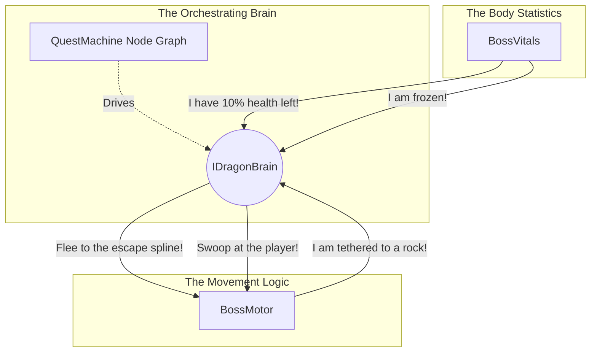

# Dragon Boss AI & Quest Machine Integration

## High-Level Concept

In this project, we are creatively using **Quest Machine** (a popular asset by PixelCrushers) not for a traditional player-facing quest log, but as a visual, node-based **Combat AI State Machine** for our bosses (e.g., the Dragon).

Instead of writing complex, hard-to-maintain state machine logic in C#, we use Quest Machine's node editor to visually design the boss's behavior.

- **Quest Nodes** represent the **AI States** (e.g., Scan, AttackCrystal, Swoop, ToppleObject, Reposition).
- **Node Conditions** act as **Transition Rules** (determining when the boss leaves a state and enters another).
- **Node Actions** define what the boss **does** when entering or during that state (such as playing an animation, moving, or triggering an attack).

The Quest Machine is completely invisible to the player. While the concept is solid, our initial implementation resulted in tight coupling, mixed responsibilities, and confusing naming conventions. Below is a breakdown of our first attempt, its flaws, and the optimal modular architecture we are moving towards.

---

## Phase 1: The First Attempt (Current Implementation)

Our initial approach proved that Quest Machine could drive AI, but the engineering was messy. The biggest issue stems from confusing naming and a lack of proper delineation between the containers for body statistics, movement logic, and the brain itself.

### The Components

1. **`DragonBrainController` (The Engine)**
   - **Role:** Loads and clones the `Quest` asset, adding it to an invisible `QuestJournal` to kick off the behavior sequence.

2. **`DragonActionListeners` (The Message Router)**
   - **Role:** Listens for `"DragonActions"` messages from the Quest Machine and delegates them.
   - **The Flaw:** It is too deeply involved in multiple domains, manually commanding movement logic, firing breath attacks, and altering phases directly in the body statistics.

3. **`BossCreature` (The Confusing Naming)**
   - **Role:** Currently manages Health, Stamina, and Phase state (`Orchestrator`, `Engaged`, `Exhausted`, `Recharging`).
   - **The Flaw (Naming & Responsibility):** The name `BossCreature` implies it represents the *entire entity* (Brain + Body Statistics + Movement Logic). However, it only acts as a container for body statistics and state. To make matters worse, it bleeds into decision-making (e.g., it decides to force an evasion when stamina drains or damage is high). This subverts the Quest Machine, meaning the actual "brain" is no longer the single source of truth.

4. **`AirborneBossMovement` (Movement Execution + Fragmented Logic)**
   - **Role:** Executes flight intents (`Pursue`, `Bank`, `Stillhold`) and path follow blending.
   - **The Flaw:** Instead of purely acting as a container for movement logic, it independently queries `BossCreature.currentPhase` and `BossCreature.GetCurrentHealthPct()` in its `Update()` loop to decide where to fly.

### Why It's Messy
- **No Intuitive Delineation:** The separation between the container for physical body statistics, the container for movement logic, and the central brain is blurred.
- **Double Responsibility:** Classes like `BossCreature` act as both a body statistics container and an AI override.

---

## Phase 2: The Optimal Solution (Architectural Evolution)

To resolve the messiness, we must rebuild the architecture with intuitive delineation. A boss logically consists of three distinct concepts: **The Container for Body Statistics**, **The Container for Movement Logic**, and **The Central Brain**.

### Introducing the Triad Architecture

We will rename and restructure the classes to enforce strict boundaries. The Brain acts as the central orchestrator, while the Body Statistics and Movement Logic act as its sensors and actuators.

### The Clean Responsibilities & Information Flow

To understand why the Brain must talk to the other two classes, we can look at a concrete example of how they communicate.

#### 1. The Body Statistics (Replacing `BossCreature` with `BossVitals`)
- **Role:** It acts purely as a sensor and container for numbers (Health, Stamina, Status Effects).
- **What it does:** It takes damage, and when a threshold is crossed, it notifies the Brain. It makes absolutely no decisions on its own.
- **Example Flow:**
  - Player shoots the dragon with an Ice Arrow.
  - Body Statistics calculates the damage and updates its internal status to "Frozen".
  - Body Statistics tells the Brain: *"Hey, I just took massive damage and I am currently frozen."*

#### 2. The Movement Logic (Refactoring `AirborneBossMovement` into a `BossMotor`)
- **Role:** It purely handles physical locomotion. It knows *how* to move through the environment, but lacks the *reason* to move.
- **What it does:** It knows the math to perform freestyle flight, transition onto escape splines, or swoop. It simply waits for orders and executes them. It also acts as a spatial sensor, reporting when environmental changes happen.
- **Example Flow:**
  - The player successfully attaches a tether to the dragon.
  - The Movement Logic tells the Brain: *"Hey, I have been tethered to a rock!"*

#### 3. The Brain (The Central Orchestrator: `IDragonBrain`)
- **Role:** The entity's comprehension of the environment, the undisputed master of behavior, and the sole decision-maker. It holds the combat strategy (driven by the Quest Machine node graph).
- **What it does:** It receives the sensor data from the Body and Movement, evaluates that data against its current strategy, and orchestrates a response by commanding the Body and Movement.
- **Concrete Orchestration Example:**
  - **Input from Body:** *"Hey, I am currently frozen and have 10% health left!"*
  - **Brain's Internal Logic (Quest Machine Condition):** "If health < 25% AND status == frozen -> Enter Desperate Evasion State."
  - **Brain's Orchestration (Output):** The Brain commands the Movement Logic: *"Execute an immediate escape to the nearest spline!"* The Brain also commands the Spawner: *"Spawn defensive minions!"*

### How Quest Machine Plugs In

With this architecture, the system is fully modular and easy to read.
- The Body Statistics and Movement Logic act as the eyes, ears, and muscles.
- The `QuestMachineDragonBrain` (which implements `IDragonBrain`) takes the reports (e.g., *"I'm frozen"*, *"I'm tethered"*) and feeds them directly into the Quest Machine graph as conditions.
- The visual nodes in Quest Machine process these conditions, transition to the appropriate combat state, and send action commands back out to orchestrate the fight.

This optimal solution guarantees that our naming makes intuitive sense, and our visual node graph remains the strict, decoupled master of the boss's behavior.
